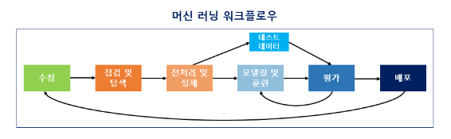

# 전중석

## 딥러닝을 이용한 자연어 처리

### 파이썬 아나콘다

- Numpy, Pandas, Jupyter Notebook, IPython, scikit-learn, matplotlib, seaborn, nltk 등의 패키지 포함

[https://www.anaconda.com/distribution/](https://www.anaconda.com/distribution/)

설치

아나콘다 프롬프트에서 아나콘다 파이썬 패키지 업데이트

```bash
conda update -n base conda
conda update --all
```

---

### 구글 코랩

[https://colab.research.google.com/](https://colab.research.google.com/)

딥러닝에서는 CPU보다는 GPU를 사용한다. Colab에서는 GPU를 무료로 사용할 수 있다.

---

### 필요 프레임워크와 라이브러리

아나콘다를 설치했다면 기본적으로 Numpy, Pandas, Jupyter notebook, scikit-learn, matplotlib, seaborn, nltk 등이 이미 설치되어져 있다. 그래서 아나콘다에 포함되어있지 않은 tensorflow, keras, gensim과 같은 패키지만 별도로 pip를 통해 설치한다.

Tensorflow: 머신러닝와 딥러닝을 직관적이고 손쉽게 할 수 있도록

Keras: 텐서플로우에 대한 추상화된 API 제공

Gensim: 머신러닝을 사용하여 토픽 모델링과 자연어 처리 수행

Scikit-learn: 나이브 베이즈 분류, 서포트 벡터 머신 등 머신 러닝 모듈 불러오기

Jupyter Notebook: 웹에서 코드를 작성하고 실행할 수 있는 오픈소스 웹 어플리케이션

### 자연어 처리를 위한 NLTK와 KoNLPy 설치

NLTK와 NLTK Data 설치

```bash
import nltk
nltk.download()
```

KoNLPy 설치

```bash
pip install konlpy
```

---

**Pandas**

파이썬 데이터 처리 라이브러리

외부 데이터 읽기

```bash
import pandas as pd
df = pd.read_csv('D:\youtube.csv')
print(df)
```

**Numpy**

수치 데이터를 다루는 파이썬 패키지. 다차원 행렬 자료구조인 ndarray를 통해 벡터 및 행렬을 사용하는 선형 대수 계산에서 사용

**Matplotlib**

데이터를 차트나 플롯으로 시각화하는 패키지

---

**Pandas-Profiling**

데이터 내 값의 분포, 변수 간의 관계, Null 값과 같은 결측값 존재 유무 등을 파악하게 되는데 이와 같은 데이터를 파악하는 과정을 EDA라고 한다. 

```bash
pip install pandas-profiling==3.1.0
# 버전 문제로 3.1.0 설치
```

```bash
import pandas as pd
import pandas_profiling

data = pd.read_csv('D:\youtube.csv')
pr = data.profile_report()
pr.to_file('./pr_report.html')
```

---

**머신 러닝 워크플로우**



---

### 텍스트 전처리

**토큰화, 정제, 정규화**

토큰화: 코퍼스에서 용도에 맞게 토큰을 분류하는 작업

정제: 갖고 있는 코퍼스로부터 노이즈 데이터 제거

정규화: 표현 방법이 다른 단어들을 통합시켜서 같은 단어로 만듬

**한국어에서의 어간 추출**

| 언 | 품사 |
| --- | --- |
| 체언 | 명사, 대명사, 수사 |
| 수식언 | 관형사, 부사 |
| 관계언 | 조사 |
| 독립언 | 감탄사 |
| 용언 | 동사, 형용사 |

**한국어에서 불용어 제거**

```bash
okt = Okt()

example = "고기를 아무렇게나 구우려고 하면 안 돼. 고기라고 다 같은 게 아니거든. 예컨대 삼겹살을 구울 때는 중요한 게 있지."
stop_words = "를 아무렇게나 구 우려 고 안 돼 같은 게 구울 때 는"

stop_words = set(stop_words.split(' '))
word_tokens = okt.morphs(example)

result = [word for word in word_tokens if not word in stop_words]
```

`불용어 제거 후 : ['고기', '하면', '.', '고기', '라고', '다', '아니거든', '.', '예컨대', '삼겹살', '을', '중요한', '있지', '.']`

[https://www.ranks.nl/stopwords/korean](https://www.ranks.nl/stopwords/korean)

불용어가 많은 경우에는 코드 내에서 직접 정의하지 않고 txt 파일이나 csv 파일로 정리해놓고 이를 불러와서 사용

---

### 한국어 전처리 패키지

띄어쓰기가 되어있지 않은 문장을 띄어쓰기를 한 문장으로 변환해주는 패키지

```bash
pip install git+https://github.com/haven-jeon/PyKoSpacing.git
```

네이버 한글 맞춤법 검사기 바탕으로 만들어진 패키지

```bash
pip install git+https://github.com/ssut/py-hanspell.git
```

띄어쓰기 및 철자 보정

```python
import pandas as pd
from hanspell import spell_checker

# 불러오기
data = pd.read_csv('D:\youtube.csv')
tmp = df_1['댓글']
df=tmp.to_frame(name='comment')

# 100단위로 분리하여 저장
for i in range(0, int(len(df)/100)+1):
	if len(df) > 100:
		df[i*100:(i+1)*100].to_csv("D:\youtube\df_{}.csv".format(i), encoding="utf-8-sig")
		
	else:
		df[(i+1)*100:].to_csv("D:\youtube\df_{}.csv".format(i), encoding="utf-8-sig")

i=0
split=[]

# 띄어쓰기 및 철자 보정
while True:
    try:
        globals()['df_{}'.format(i)] = pd.read_csv('D:\youtube\df_{}.csv'.format(i))
        tmp = globals()['df_{}'.format(i)]['comment']
        globals()['df_{}'.format(i)] = tmp.tolist()
        globals()['result_{}'.format(i)] = spell_checker.check(globals()['df_{}'.format(i)])

        split.append([])
        for j in range(100):
            split[i].append(((globals()['result_{}'.format(i)][j].checked)))
        i=i+1
    except:
        break

# 파일 저장
tmp=sum(split,[])
df=pd.DataFrame(tmp, columns=['comment'])
df.to_csv("D:\\youtube_result.csv", encoding="utf-8-sig")
```