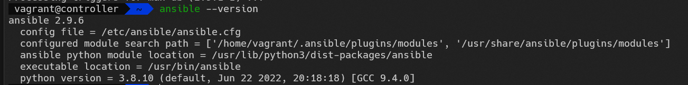
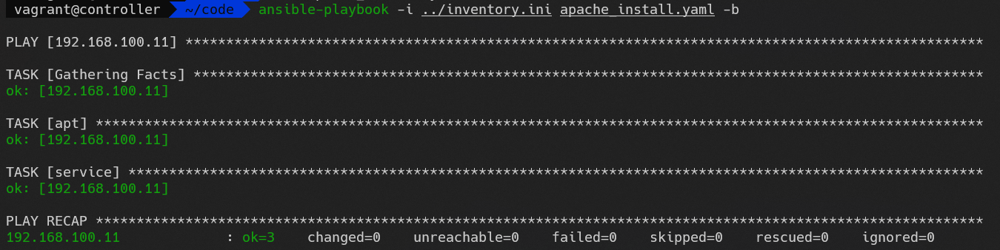

# Ansible
#### 목차
- Ansible
	- Ansible 아키텍처
		- 설정
		- 모듈
		- 인벤토리
	- Ad-hoc
	- **Playbook**
		- YAML
		- 변수, 조건문, 반복문
		- 포함, 역할, ...
	- Vault: 암호화
	- AWX: 웹 인터페이스(모니터링)

## IaC란?
Infrastructure as Code: 코드형 인프라
장점
- 비용 절감
- 빠른 속도
- 안정성
- 재사용성
- 버전 관리

## 구성 관리 / 배포
구성 관리: Configuration Management 패키지 설치, 설정 파일, 파일 복사, ..., 배포: Provisioning 리소스 새로 생성, 리소스 변경, 삭제, 관리
구성관리 도구: **Ansible**, Chef, Puppet, SaltStack, ...
배포: **Terraform**, Vagrant, AWS CloudFormation

## 가변 인프라 / 불변 인프라
가변: Mutable Ansible
불변: Immutable Terraform

## 절차적 / 선언적
절차적: 순서 존재, Ansible
선언적: 순서 부재, Terraform, Kubernetes

## 마스터 및 에이전트 유무
마스터, 에이전트: Chef, Puppet, SaltStack

## node1, node2 패스워드 인증 활성화
``` bash
vagrant ssh node1
```

`/etc/ssh/sshd_config`
``` bash
PasswordAuthentication yes
```

```
sudo systemctl restart httpd
```

## controller
``` bash
vagrant ssh controller
```

``` bash
ssh-keygen
```

``` bash
ssh-copy-id vagrant@192.168.100.11
ssh-copy-id vagrant@192.168.100.12
```

## Ansible 실습
Ansible 설치 `controller`
```
sudo apt install ansible
```

설치 확인
```
ansible --version
```


인벤토리
`inventory.ini`
```
192.168.100.11
192.168.100.12
```

## Ad-hoc 명령
apt 모듈로 apache2 패키지 설치
``` bash
ansible 192.168.100.11 -i inventory.ini -m apt -a "name=apache2 state=present" -b
```

- ansible: ad-hoc 명령
- 192.168.100.11: 관리 노드(인벤토리 파일 정의 되어 있어야 함)
- -i inventory.ini: 인벤토리 파일명
- -m apt: 모듈 이름
- -a: 모듈 파라미터
- -b: 관리자 권한 취득(become -> sudo)

service 모듈로 apache2 서비스 시작
``` bash
ansible 192.168.100.11 -i inventory.ini -m service -a "name=apache2 state=started enabled=yes" -b
```
| https://docs.ansible.com/ansible/2.9/modules/service_module.html#service-module 참고

Playbook: `apache_install.yaml`
```
- hosts: 192.168.100.11
  tasks:
  - apt:
      name: apache2
      state: present
  - service:
      name: apache2
      enabled: yes
      state: started
```

``` bash
ansible-playbook -i inventory.ini apache_install.yaml -b
```


## Ansible?
IT 인프라 구성 관리 자동화 도구
Ansible:
- YAML: 구성 용이
- OpenSSH: 표준 통신 방식

### 용어
제어 노드
Control Node, Controller, Ansible Engine
조건: Unix 계열, Python

관리 노드
Managed Node, Target Node/Host, ...
BM, VM, Instance, Network Device
조건:
- SSH가 가능한 모든 시스템, Python 설치
- Windows: WinRM(Windows Remote Management)

#### 인벤토리
- 정적 인벤토리: 관리 노드의 목록 파일
- 동적 인벤토리: 클라우드 CMDB에서 관리 노드 목록 가져옴

#### 플러그인
Ansible 기능 확장

#### 모듈
Ansible 작업 실핼할 수 있는 기본 단위 Python Code

#### Ad-hoc
Ansible 임시 실행
하나의 모듈을 실행

#### Task
하나의 모듈을 실행 -> 하나의 Task(작업)

#### 플레이
하나 이상의 테스크의 모음

#### 플레이북
하나 이상의 플레이 모음