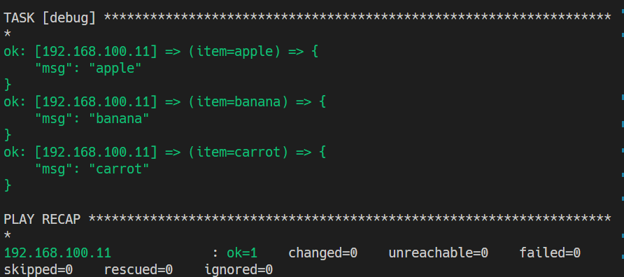
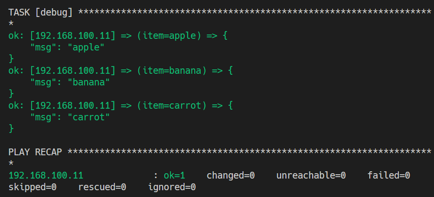
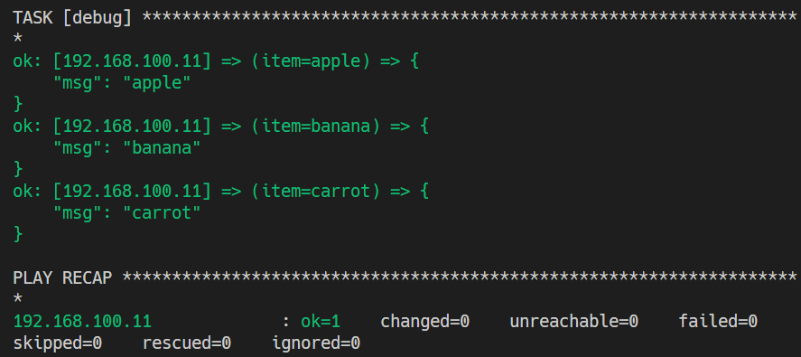
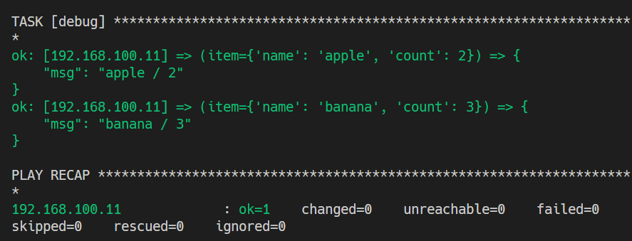

# 반복문
| https://docs.ansible.com/ansible/latest/user_guide/playbooks_loops.html#playbooks-loops
Task에서 `loop`, `with`, `until` 반복문 구성

## 리스트 반복문

`loop` 대신, `with_items`, `with_list`

``` yaml
- hosts: 192.168.100.11
  gather_facts: no

  tasks:
    - debug:
        msg: "{{ item }}"
      with_items:
        - apple
        - banana
        - carrot
```


``` yaml
- hosts: 192.168.100.11
  gather_facts: no
  vars:
    fruits:
      - apple
      - banana
      - carrot

  tasks:
    - debug:
        msg: "{{ item }}"
      with_items:
        "{{ fruits }}"
```


``` yaml
- hosts: 192.168.100.11
  gather_facts: no
  vars:
    fruits:
      - apple
      - banana
      - carrot

  tasks:
    - debug:
        msg: "{{ item }}"
      loop:
        "{{ fruits }}"
```


## 사전 반복문
`loop` 대신 `with_dict`

``` yaml
- hosts: 192.168.100.11
  gather_facts: no
  vars:
    fruits:
      - name: apple
        count: 2
      - name: banana
        count: 3

  tasks:
    - debug:
        msg: "{{ item.name }} / {{ item.count }}"
      loop:
        '{{ fruits }}'
```
