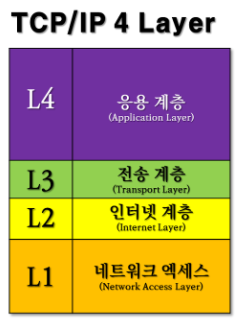

# 네트워크

네트워크 구성

## 네트워크 기술

네트워크 기술이란, 서버와 클라이언트의 정보가 오고 가는 다리 역할을 하는 기술의 총칭을 의미한다

## LAN (Local Area Network)

LAN 이란 기업이나 조직 등 비교적 좁은 접위 안에 존재하는 컴퓨터 네트워크를 의미한다.
LAN은 LAN 케이블을 이용하여 데이터를 전송하는 유선 LAN과 전파를 이용하여 데이터를 전송하는 무선 LAN으로 구분한다.

## 네트워크 작동 원리
네트워크는 OSI 참조 모델을 바탕으로 작동한다. OSI 참조 모델은 ISO가 컴퓨터 통신 기능을 계층 구조로 나눠서 정리한 모델로 일종의 통신 규칙 모음이라 생각하면 된다.

### OSI 7 Layer

#### 개념

- 개방형 시스템 상호 연결 모델의 표준
- 실제 인터넷에서 사용되는 TCP/IP는 OSI 참조 모델을 기반으로 상업적이고 실무적으로 이용될 수 있도록 단수화한 것

#### 작동 원리

1. OSI 7 Layer는 응용, 표현, 세션, 전송, 네트워크, 데이터링크, 물리계층으로 나뉨
2. 전송 시 7 계층에서 1 계층으로 각각의 층마다 인식할 수 있어야 하는 헤더를 붙임(헤더)
3. 수신 시 1 계층에서 7 계층으로 헤더를 떼어냄(디캡슐화)
4. 출발지에서 데이터가 전송될 때 헤더가 추가되는데 2 계층에서만 오류제어를 위해 tail에 추가됨
5. 물리계층에서 1,0 의 신호가 되어 전송매체를 통해 전송

#### 물리 계층(Physical Layer)

- 7 계층 중 최하위 계층
- 주로 전기적, 기계적, 기능적인 특성을 이용해 데이터를 전송
- 데이터는 0과 1의 비트열, 즉 On, Off의 전기적 신호 상태로 이루어져 해당 계층은 단지 데이터를 전달
- 단지 제이터 전달의 역할을 할 뿐이라 알고리즘, 오류제어 기능이 없음
- 장비로는 케이블, 리피터, 허브가 있음

#### 데이터링크 계층(DataLink Layer)

- 물리적인 연결을 통하여 인접한 두 장치 간의 신뢰성 있는 정보 전송을 담당(Point to Point 전송)
- 안전한 정보의 전달이라는것은 오류나 재전송하는 기능이 존재
- MAC 주소를 통해서 통신
- 데이터링크 계층에서 데이터 단위는 프레임
- 장비로는 브리지, 스위치가 있음

#### 네트워크 계층(Network Layer)

- 중계 노드를 통하여 전송하는 경우 어떻게 중계할 것인가를 규정
- 라우팅 기능을 맡고 있는 계층으로, 목적지까지 가장 안전하고 빠르게 데이터를 보내는 기능을 가지고 있음(최적의 경로를 설정 가능)
- 컴퓨터에게 데이터를 전송할지 주소를 갖고 있어 통신 가능(IP 주소)
- 네트워크 계층에서 데이터 단위는 패킷
- 장비로는 라우터, L3 스위치가 있음

#### 전송 계층(Transport Layer)

- 종단 간 신뢰성 있고 정확한 데이터 전송을 담당
- 송신자와 수신자 간의 신뢰성있고 효율적인 데이터를 전송하기 위하여 오류검출 및 복구, 흐름제어와 중복검사 등을 수행
- 데이터 전송을 위하여 Port 번호를 사용함
  - 대표적인 프로토콜로 TCP와 UDP가 있음
- 전송 계층에서 데이터 단위는 세그먼트

TCP
- 연속성보다 신뢰성있는 전송이 중요할 때에 사용하는 프로토콜
- 연결헝 서비스로 가상 회선 방식을 제공한다.
- 3-way handshaking 과정을 통해 연결을 설정하고 4-way handshaking을 통해 해제한다.
- 흐름 제어 및 혼잡 제어
- 높은 신뢰성을 보장한다.
- UDP 보다 속도가 느리다.
- 전이중, 점대점 방식.

UDP
- 신뢰성보다 연속성이 중요할 때에 사용하는 프로토콜
- 비연결형 서비스로 데이터그램 방식을 제공한다.
- 정보를 주고 받을 때 정보를 보내거나 받는다는 신호절차를 거치지 않는다. 
- UDP 헤더의 CheckSum 필드를 통해 최소한의 오류만 검출한다.
- 신뢰성이 낮다.
- TCP 보다 속도가 느리다.

|프로토콜 종류|TCP|UDP|
|------|---|---|
|연결 방식|연결형 서비스|비연결형 서비스|
|패킷 교환 방식|가상 회선 방식|데이터그램 방식|
|전송 순서|전송 순서 보장|전송 순서가 바뀔 수 있음|
|수신 여부 확인|수신 여부를 확인함|수신 여부를 확인하지 않음|
|통신 방식|1:1 통신|1:1 / 1:N, N:N 통신|
|신뢰성|높다|낮다|
|속도|느리다|빠르다|

### OSI 7 Layer 장비

#### 물리 계층

리피터 : 긴 케이블일수록 신호가 약해지기 때문에 신호를 멀리 보내기 위한 증폭 장치이다. 지금은 다른 네트워크 장비에 기본적으로 리피터 기능이 탑재되어 있어 사용하지 않는다.

허브 : 리피터 역할을 하며, 기존 리피터와 다르게 여러 장비를 연결할 수 있다. 특징으로는 허브는 CSMA/CD 방식을 적용하고 있기 때문에 여러 장비에서 동시에 데이터를 전송하지 못한다.

#### 데이터링크 계층

브리지 : 네트워크 세그먼트를 서로 연결해 주는 장치이다. 세그먼트라고 하면 경우에 따라서 의미가 다르다. 여기에서 세그먼트란 하나의 큰 네트워크를 구성하는 작은 네트워크들을 세그먼트라고 표현한다. 그 세그먼트를 연결해주는 것이 브리지, 스위치 등과 같은 장비들이 있다.

스위치 : 스위치를 브리지와 비슷하지만 차이가 있다. 처리방식이 스위치는 하드웨어, 브리지는 소프트웨어 방식이기 때문에 속도는 스위치가 훨씬 빠르다. 또한 브리지에 비해 제공되는 포트 수도 많고, 포트 별로 속도를 지정할 수 있다. 여러모로 브리지의 상위 호환 장비이므로 브리지는 현재 사용되진 않는다.

> L2 스위치 : 데이터링크 계층에서 작동하며, MAC Address를 기반으로 패킷을 전달한다.
> L3 스위치 : L2 스위치에 라우팅 기능이 추가된 장비로 IP 정보를 보고 스위칭한다.
> L4 스위치 : 4계층 프로토콜인 TCP/UDP를 이용하여, IP와 PORT 기반으로 스위칭을 한다. L4 스위치에서는 부하 분산 기능을 제공하는데, 많은 양의 트래픽을 여러 서버로 분산시켜주는 기능을 말한다.
> L7 스위치 : L4 스위치와 기능과 역할을 동일하나, L7 스위치에서는 추가로 페이로드를 분석하여 패킷을 처리한다. 페이로드를 분석함으로써 DoS나 SYN Attack 등 네트워크 공격에 대해 방어가 가능하고, 특정 바이러스 감염 패킷을 필터링할 수 있다.

> L4 Load Balancer : IP, Port를 기준으로 스케줄링 알고리즘을 통해 부하 분산
> L7 Load Balancer : L7 위에서 동작하기 때문에 IP, Port 이외에도 URI, Payload, HTTP Header, Cookie 등의 내용을 기준으로 부하를 분산한다. 따라서 콘텐츠 기반 스위칭이라고도 한다.
> L4 Load Balancer는 단지 부하를 분산시키는 것이라면, L7 Load Balancer는 요청의 세부적인 사항을 두고 결제만 담당하는 서버, 회원가입만을 담당하는 서버 등으로 분리해서 가볍고 작은 단위로 여러 개의 서비스를 운영하고 요청을 각각의 서버에 분산할 수 있다는 것이다.

#### 네트워크 계층

라우터 : 라우터는 네트워크 간 데이터 전송을 위해 최적 경로를 설정하며, 이 경로를 따라 데이터를 전송하는 장비를 말한다.

#### 세션 계층(Session Layer)

- 통신 장치 간 상호작용 및 동기화를 제공
- 연결 세션에서 데이터 교환과 에러 발생 시의 복구를 관리

#### 표현 계층(Presentation Layer)

- 데이터를 어떻게 표현할지 정하는 역할을 하는 계층
- 표현 계층은 세가지의 기능을 갖고 있다.
  - 송신자에서 온 데이터를 해석하기 위한 응용계층 데이터 부호화, 변화
  - 수신자에서 데이터의 압축을 풀 수 있는 방식으로 된 데이터 압축
  - 데이터의 암호화와 복호화

#### 응용 계층(Application Layer)

- 사용자와 가장 밀접한 계층으로 인터페이스 역할
- 응용 프로세스 간의 정보 교환을 담당

### TCP/IP

데이터가 의도된 목적지에 닿을 수 있도록 보장해주는 통신 규약
TCP/IP를 사용하면 한 컴퓨터가 데이터 패킷을 컴파일하고 올바른 위치로 전송하여 인터넷을 통해 다른 컴퓨터와 통신할 수 있다.

#### TCP
최상위 계층인 TCP는 많은 양의 데이터를 가져와서 패킷으로 컴파일 한 다음 동료 TCP 계층에서 수신하도록 전송하여 패킷을 유용한 정보/데이터로 바꾸는 역할을 한다.

#### IP
Internet Protocol의 준말로, 인터넷에서 컴퓨터의 위치를 찾아 데이터를 전송하기 위해 지켜야 할 규약이다.

### TCP/IP 4 Layer

#### 네트워크 액세스 계층(Network Access Layer)

- OSI 7 Layer의 물리계층과 데이터 링크 계층에 해당
- TCP/IP 패킷을 네트워크 매체로 전달하는 것과 네트워크 매체에서 TCP/IP 패킷을 받아들이는 과정을 담당
- 에러 검출 기능(Detecting errors), 패킷의 프레임화(Framig packets)
- 네트워크 접근 방법, 프레임 포맷, 매체에 대해 독립적으로 동작하도록 설계
- 물리적인 주소로 MAC을 사용
- LAN, 패킷망, 등에 사용됨

#### 인터넷 계층(Internet Layer)

- OSI 7 Layer의 네트워크 계층에 해당
- addressing, packaging, routing 기능을 제공
- 네트워크상 최종 목적지까지 정확하게 연결되도록 연결성을 제공하게 됨
- 프로토콜 종류 : IP, ARP, RARP

#### 전송 계층(Transport Layer)

- OSI 7 Layer의 전송 계층에 해당
- 애플리케이션 계층의 세션과 Datagram 통신서비스 제공
- 통신 노드 간의 연결을 제어하고, 신뢰성있는 데이터 전송을 담당
- 프로토콜 종류 - TCP, UDP

#### 응용 계층(Application Layer)

- OSI 7 Layer의 세션 계층, 표현 계층, 응용 계층에 해당
- 프로그램이 직접 interact하는 레이어(데이터를 처음으로 받는곳)
- 다른 계층의 서비스에 접근할 수 있게 하는 애플리케이션을 제공
- 애플리케이션들이 데이터를 교환하기 위해 사용하는 프로토콜을 정의
- HTTP, SMTP등의 프로토콜을 가진다.
- TCP/UDP 기반의 응용 프로그램을 구현할 때 사용한다.
- 프로토콜 종류 – FTP, HTTP, SSH

## MAC Address

MAC : Media Access Control

통신을 하기위해서 서로를 구분할 일종의 주소가 필요하게 되는데 이 역할을 MAC Adress가 담당한다.
인터넷은 TCP/IP로 통신을 하고 따라서 통신을 하기 위해서 IP주소를 사용한다. 하지만 이 경우에도 MAC Adress를 사용한다.
즉 우리가 통신을 할 때 IP주소를 다시 MAC으로 바꾸는 절차(ARP)를 밟고 있다.

#### 같은 네트워크 상에 있을 경우

두 컴퓨터가 서로 통신을 하려고 할 때 상대방의 주소를 알고 있다.
이때 본인이 속한 네트워크에 있는 모든 PC에게 같은 네트워크에 있으면 본인과 통신하고 싶으니 MAC Adress를 요구를 하게 된다.
그럼 상대방은 MAC Adress를 알려주게 되고 받은 MAC Adresss로 통신을 시작하게 된다.

#### 다른 네트워크 상에 있을 경우

같은 네트워크 상에 있는 경우와 같이 Broadcast를 보내게 된다.
하지만 상대방은 이 경우 ARP Request를 받지 못하게 된다. 이때 라우터가 다른 네트워크에 있는 상대방에게 전달하게 된다.
따라서 정보를 보낼 때 받는 MAC Adress를 라우터에게 보내게 된다.

> ARP : 상대방의 MAC 주소를 알아오는 프로토콜
> RARP : MAC 주소에 해당하는 IP 주소를 알아오는 프로토콜
> GARP : 송신 IP와 수신 IP가 동일한 ARP 요청 -> 자신의 존재를 알리는 목적

