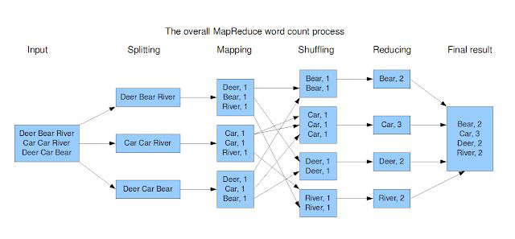

# 전중석

### 참고자료

위키독스 빅데이터 - 하둡, 하이브로 시작하기

[https://wikidocs.net/22652](https://wikidocs.net/22652)

위키독스 빅데이터 - 스칼라, 스파크로 시작하기

[https://wikidocs.net/book/2350](https://wikidocs.net/book/2350)

위키독스 딥러닝을 이용한 자연어 처리 입문

[https://wikidocs.net/book/2155](https://wikidocs.net/book/2155)

빅데이터는 분산파일시스템과 분산처리방식으로 문제를 해결한다.

- 분산파일시스템 - 고가용성
- 분산처리방식 - 분업화

Scale-out으로 여러 vm을 만들어 처리가능한 데이터량을 수십-수백 PB까지 생성

하둡 = HDFS(저장) + MapReduce(처리)

- MapReduce V1: 잡트래커(마스터) / 태스크트래커(슬레이브)
- MapReduce V2 이후: 노드매니저 / 리소스매니저

### 하둡 아키텍쳐(맵리듀스)



Split 입력이 들어가면 Mapper의 개수로 분할이 일어나고 입력이 들어간다.

Split을 통해 데이터가 들어오면 Mapper는 (단어, 1)의 방식으로 만든다(고가용성, 단어 늘리기 ㅇ)

Reducer에 바로 들어가지 않고 셔플링 과정을 거친다. 셔플링이 섞는것 같아 보이지만, 해당되는 Reducer로 보내라는 동작을 하도록 로직이 들어간다. → 같은 단어끼리 그룹화하여 알맞은 Reducer로 들어가도록

Reducer는 (단어, n)으로 줄이는 역할을 한다. 각각의 Reducer가 총합하면 최종 결과가 나오게 된다.

⇒ 하둡의 경우 컴퓨터 여러 대가 묶여 실행하게 되며 분산파일시스템과 분산처리방식의 장점을 살린다.

하둡 1

- 배치 작업에 최적화
- 자원활용 방법의 문제점
    - 맵과 리듀서의 일이 정해져 있다.
    - 매퍼가 결과를 내야 리듀서가 일을 한다(한쪽만 바쁨)
- SPOF

하둡2

- **얀 도입**(리소스 관리 툴)
- 하둡1의 잡트래커 + 태스크트래커 → 노드매니저(작업) + 리소스매니저(리소스)로 변경
- **주키퍼 도입** (하둡 1의 네임노드, 세컨더리 네임노드 장애에 대비)
    - 고가용성 주키퍼에서 네임노드가 정지되지 않도록 Active-Standby, Active-Active

하둡3

- 블록복제
    - RAID 5,6 (가용성은 높지만 많은 데이터 공간 필요)

**하둡 설치**

- 완전분산모드, hadoop3
    - 각 서버를 여러 대의 시스템에 나눠 실행

vagrant master, slave1, slave2 생성

공통사항

1. 자바 설치 및 환경변수 설정

```bash
wget https://download.java.net/java/ga/jdk11/openjdk-11_linux-x64_bin.tar.gz
tar -xvf openjdk-11_linux-x64_bin.tar.gz
sudo mkdir /usr/lib/jvm
sudo cp -r jdk-11 /usr/lib/jvm/java-11-openjdk-amd64

#환경변수
export JAVA_HOME=$(dirname $(dirname $(readlink -f $(which java))))
export PATH=$PATH:$JAVA_HOME/bin
```

1. 하둡 설치

```bash
wget http://mirror.apache-kr.org/apache/hadoop/common/hadoop-3.3.3/hadoop-3.3.3.tar.gz
tar -xzf hadoop-3.3.3.tar.gz
mv hadoop-3.3.3 hadoop

#환경변수
export HADOOP_HOME=/home/vagrant/hadoop
export PATH=$PATH:$JAVA_HOME/bin:$HADOOP_HOME/bin:$HADOOP_HOME/sbin:
export HADOOP_STREAMING=$HADOOP_HOME/share/hadoop/tools/lib/hadoop-streaming-3.3.1.jar
```

1. /etc/hosts

```bash
192.168.100.101 master
192.168.100.102 slave1
192.168.100.103 slave2
```

master 노드

1. 각 slave의 인증키 전송

```bash
ssh-keygen -t rsa -f ~/.ssh/id_rsa
cat ~/.ssh/id_rsa.pub >> ~/.ssh/authorized_keys
chmod 0600 ~/.ssh/authorized_keys

ssh-copy-id -i /home/vagrant/.ssh/id_rsa.pub slave1
ssh-copy-id -i /home/vagrant/.ssh/id_rsa.pub slave2
```

`cd hadoop/etc/hadoop`

1. core-site.xml

```bash
<configuration>
  <property>
    <name>fs.defaultFS</name>
    <value>hdfs://master:9000</value>
  </property>
</configuration>
```

1. hdfs-site.xml

```bash
<configuration>
# namenode 데이터 경로 설정
  <property>
      <name>dfs.namenode.name.dir</name>
      <value>/home/vagrant/hadoop/data/namenode</value>
  </property>

# datanode 데이터 경로 설정
  <property>
      <name>dfs.datanode.data.dir</name>
      <value>/home/vagrant/hadoop/data/datanode</value>
  </property>

# data 복제 갯수 설정 (장애 대응)
  <property>
      <name>dfs.replication</name>
      <value>1</value>
  </property>

# secondary namenode 설정
  <property>
      <name>dfs.namenode.secondary.http-address</name>
      <value>slave1:50090</value>
  </property>
</configuration>
```

1. yarn-site.xml

```bash
  <property>
    <name>yarn.resourcemanager.hostname</name>
    <value>master</value>
  </property>

# log 출력
  <property>
    <name>yarn.log-aggregation-enables</name>
    <value>true</value>
  </property>

  <property>
    <name>yarn.nodemanager.aux-services</name>
    <value>mapreduce_shuffle</value>
  </property>
  <property>
    <name>yarn.nodemanager.aux-services.mapreduce_shuffle.class</name>
    <value>org.apache.hadoop.mapred.ShuffleHandler</value>
  </property>

```

1. mapred-site.xml

```bash
  <property>
    <name>mapreduce.framework.name</name>
    <value>yarn</value>
  </property>
  <property>
    <name>yarn.app.mapreduce.am.env</name>
    <value>HADOOP_MAPRED_HOME=$HADOOP_HOME</value>
  </property>
  <property>
    <name>mapreduce.map.env</name>
    <value>HADOOP_MAPRED_HOME=$HADOOP_HOME</value>
  </property>
  <property>
    <name>mapreduce.reduce.env</name>
    <value>HADOOP_MAPRED_HOME=$HADOOP_HOME</value>
  </property>
```

1. hadoop-env.sh

```bash
# / 누르고 export JAVA_HOME 검색, #을 지우고 아래로 수정
export JAVA_HOME=/usr/lib/jvm/java-11-openjdk-amd64
```

1. workers

```bash
# 모두 지우고
master
slave1
slave2
```

1. slave에 복사

```bash
scp $HADOOP_HOME/etc/hadoop/* slave1:$HADOOP_HOME/etc/hadoop/
scp $HADOOP_HOME/etc/hadoop/* slave2:$HADOOP_HOME/etc/hadoop/
```

하둡 실행

```bash
# namenode foramt
hdfs namenode -format

# 하둡 실행 
start-dfs.sh
start-yarn.sh
```

하둡 확인

```bash
vagrant@master:~/hadoop$ jps
22081 NameNode
23540 Jps
22774 NodeManager
22599 ResourceManager
22249 DataNode

# slave1에는 세컨더리 네임노드가 있음
vagrant@slave1:~/hadoop$ jps
3360 Jps
3234 NodeManager
2931 DataNode
3059 SecondaryNameNode

vagrant@slave2:~/hadoop$ jps
2880 Jps
2757 NodeManager
2533 DataNode
```

hdfs 저장소

```bash
hdfs dfs -mkdir -p /user/wordcount
hdfs dfs -put $HADOOP_HOME/README.txt /user/wordcount
```

---

Map Reduce 예제 실행 (`~/hadoop`)

```bash
hadoop jar $HADOOP_HOME/share/hadoop/mapreduce/hadoop-mapreduce-examples-3.3.3.jar wordcount /user/wordcount/README.txt /user/wordcount/example
```

결과 확인

```bash
hdfs dfs -cat /user/wordcount/example/part-r-00000

#결과
For     1
Hadoop, 1
about   1
and     1
at:     2
http://hadoop.apache.org/       1
https://cwiki.apache.org/confluence/display/HADOOP/     1
information     1
latest  1
our     2
please  1
the     1
visit   1
website 1
wiki,   1

---
#원본
For the latest information about Hadoop, please visit our website at:

   http://hadoop.apache.org/

and our wiki, at:

   https://cwiki.apache.org/confluence/display/HADOOP/
```

기본처리로만 되어있기에 전처리를 해야한다. `Hadoop,` `wiki,` `at:` 등

특정 단어가 몇 번 나왔는지 확인이 가능하다. 빈도수로 많이 나온 단어의 경우,

⇒ TopN

hadoop-mapreduce-examples-3.3.3.jar 내 org/apache/hadoop/examples/WordCount.java를 수정하여 → ?!@#:/. 이런것들 처리 가능

`WordCount.java`

```java
/**
 * Licensed to the Apache Software Foundation (ASF) under one
 * or more contributor license agreements.  See the NOTICE file
 * distributed with this work for additional information
 * regarding copyright ownership.  The ASF licenses this file
 * to you under the Apache License, Version 2.0 (the
 * "License"); you may not use this file except in compliance
 * with the License.  You may obtain a copy of the License at
 *
 *     http://www.apache.org/licenses/LICENSE-2.0
 *
 * Unless required by applicable law or agreed to in writing, software
 * distributed under the License is distributed on an "AS IS" BASIS,
 * WITHOUT WARRANTIES OR CONDITIONS OF ANY KIND, either express or implied.
 * See the License for the specific language governing permissions and
 * limitations under the License.
 */
package org.apache.hadoop.examples;

import java.io.IOException;
import java.util.StringTokenizer;

import org.apache.hadoop.conf.Configuration;
import org.apache.hadoop.fs.Path;
import org.apache.hadoop.io.IntWritable;
import org.apache.hadoop.io.Text;
import org.apache.hadoop.mapreduce.Job;
import org.apache.hadoop.mapreduce.Mapper;
import org.apache.hadoop.mapreduce.Reducer;
import org.apache.hadoop.mapreduce.lib.input.FileInputFormat;
import org.apache.hadoop.mapreduce.lib.output.FileOutputFormat;
import org.apache.hadoop.util.GenericOptionsParser;

public class WordCount {

  public static class TokenizerMapper
       extends Mapper<Object, Text, Text, IntWritable>{

    private final static IntWritable one = new IntWritable(1);
    private Text word = new Text();

    public void map(Object key, Text value, Context context
                    ) throws IOException, InterruptedException {
      StringTokenizer itr = new StringTokenizer(value.toString());
      while (itr.hasMoreTokens()) {
        word.set(itr.nextToken());
        context.write(word, one);
      }
    }
  }

  public static class IntSumReducer
       extends Reducer<Text,IntWritable,Text,IntWritable> {
    private IntWritable result = new IntWritable();

    public void reduce(Text key, Iterable<IntWritable> values,
                       Context context
                       ) throws IOException, InterruptedException {
      int sum = 0;
      for (IntWritable val : values) {
        sum += val.get();
      }
      result.set(sum);
      context.write(key, result);
    }
  }

  public static void main(String[] args) throws Exception {
    Configuration conf = new Configuration();
    String[] otherArgs = new GenericOptionsParser(conf, args).getRemainingArgs();
    if (otherArgs.length < 2) {
      System.err.println("Usage: wordcount <in> [<in>...] <out>");
      System.exit(2);
    }
    Job job = Job.getInstance(conf, "word count");
    job.setJarByClass(WordCount.class);
    job.setMapperClass(TokenizerMapper.class);
    job.setCombinerClass(IntSumReducer.class);
    job.setReducerClass(IntSumReducer.class);
    job.setOutputKeyClass(Text.class);
    job.setOutputValueClass(IntWritable.class);
    for (int i = 0; i < otherArgs.length - 1; ++i) {
      FileInputFormat.addInputPath(job, new Path(otherArgs[i]));
    }
    FileOutputFormat.setOutputPath(job,
      new Path(otherArgs[otherArgs.length - 1]));
    System.exit(job.waitForCompletion(true) ? 0 : 1);
  }
}
```

⇒  **자체 하둡 텍스트 기법**을 사용함 à 자바 외의 다른 기술까지 연동

- **map()은 라인별로 호출됨** 화이트스페이스 빈칸(탭, 스페이스, 엔터)를 제거하기 위해 String Tokenizer에 넣어주면 된다.
- write(word, one) 
“I”, 1 / “am”, 1 / “a”, 1 / “boy.”, 1 “You”, 1 / “are”, 1 / “a”, 1 / “girl.”, 1
- **Reduce의 입력(단어별로 한 번씩 호출)** 
“I”, [1] → “I”, 1 
“a”, [1, 1] → “a”, 2
- 합을 내서 배열을 정리

맵 태스크 수의 결정방식

- 입력 파일의 수
- 입력 파일의 크기
    - 데이터 블록마다 맵 태스크 할당
    - 데이터 블럭이 InputSplit
- 입력 포맷의 변수

---

### 스파크(Spark)

스파크 = 빅데이터처리 + 데이터분석 + SQL

하둡은 빅데이터 저장(HDFS) + 빅데이터 처리(MapReduce)

스파크는 빅데이터 처리 + 빅데이터 분석(v2 부터)

- **RDD라는 메모리기반 자료구조** 사용(성능 위주)
- 단순 빅데이터 처리에서 **분석기술로의 발전**

스파크 = 빅데이터 처리(HDFS) + 데이터 분석(Spark) + SQL + 그래프관련 처리

- 속도: 메모리 위주 관리로 100배 빠름
- 사용 편의성: 자바, 스칼라, 파이썬, R, SQL 지원
- SQL, 스트리밍, 분석(머신러닝) 지원
- Scalble 서비스 지원

별도의 파일시스템 없이 분산처리시스템으로 존재한다. **하둡의 MapReduce를 대체!!**

**Hadoop(MapReduce) → Spark(RDD) → Spark(Dataframe/Dataset)**

**RDD → 비정형데이터 Dataframe → 반정형데이터(json같은) Dataset → 정형데이터**

RDD vs. Dataframe의 API는 달랐지만 ⇒ 통합인터페이스(Dataset) 으로 통합

**RDD의 특징 3가지**

- **Read Only**
- **Fault Tolerant**
- **Lazy Loading**

RDD에서는 **변환함수/액션함수 →** **바로 실행한해도 되는 함수 / 바로 실행해야 하는 함수**

- Transformation 함수 대부분 변환함수
- **Action 함수**
reduce, collet, count, take, saveAsTextFile, countByKey, foreach
Action 함수는 실행이 되어 있어야 작업이 가능하다.
    - **Transformation은 일을 계속 미루다가, Action함수가 나오면 모든 일이 실행됨**
    - **이를 적극적으로 활용, 이를 Lazy Loading**
    

**Linage(이력)**

input → a() → output1 → b() → output2 → c() → final_output

input이 들어와서 a함수, 결과가 나오고 b함수로 output2, c()함수를 진행하고 마지막 결과 배출

input / ouput1 / output2 / final_output → RDD(수정불가능-전제), 얘는 데이터
수정은 함수를 통해서만 업데이트 되도록 제약

output1이 깨졌다면?

- input에서 a()를 적용해서 재생 가능
    - **변환함수, 액션함수로 성능을 높이고,**
    - **Linage 형태로 복원이 가능**
    

따라서 Linage로 Read Only가 되고, Linage로 Fault Tolerant가 된다.

---

### **스칼라 언어**

변수(variable) vs. 상수(constant(c++) / final(java)

Scala는 var vs. val

cf. mutable vs. immutable(값을 못 바꾸게 하는 변수)

C에서는
#define PI 3.14

C++에서는
const int PI = 3.14;

Java에서는
final int PI = 3.14;

스칼라 언어의 특징

- **val: immutable(수정 불가능한 변수, 스파크에서는 val(RDD)를 사용) [최초 정의는 가능]**
- var: mutable(일반적인 변수)
    - 수정 불가능한 변수 – 스파크의 RDD RDD의 Scala의 val에 해당한다.

스파크에서는 val(RDD)를 쓴다.

스칼라 람다식 함수정의

- 똑같은 기능인데, 간편해짐
- **(a, b) =>(a+b)**
- print ((a, b) =>(a+b))(10, 20)
- 근데 (a, b) =>(a+b)는 **(_+_)**로도 변경 가능
