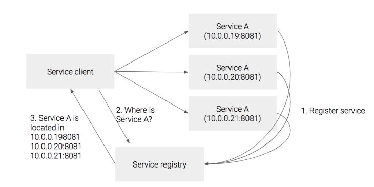
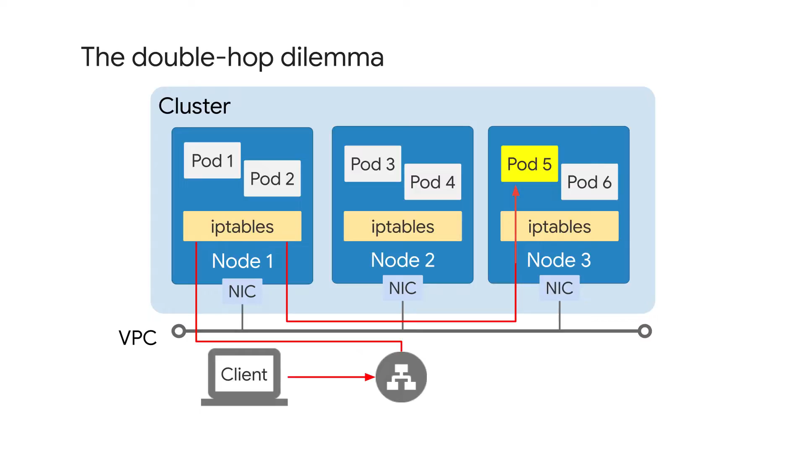
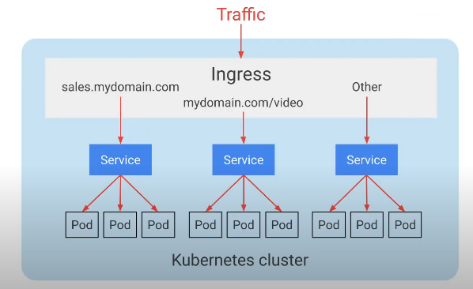

# Service & DNS & Ingress

VM과 Pod의 수명 주기는 매번 다르다. 애플리케이션 업데이트와 업그레이드 시에도 VM은 일반적으로 내구성과 지속성을 갖도록 설계되는 반면 Pod는 일반적으로 종료되고 새로운 Pod로 교체된다. 새로운 Pod 배포의 결과, 업데이트되고 컨테이너화된 버전의 애플리케이션은 새 IP 주소를 얻는다. 또한 Pod가 다시 예약되는 경우 새 IP 주소를 얻는다.

이러한 예기치 않은 주소 변경으로 인해 서비스 장애가 발생할 수 있다. Pod IP 주소는 임시적이기 때문에, 클러스터에서 실행 중인 애플리케이션을 찾을 수 있는 방법이 필요하다.

Kubernetes 서비스는 IP 주소의 동적 컬렉션을 생성하는 객체이다. 이를 엔드포인트라 하며, service label selector와 일치하는 Pod에 속한다. 사용자가 Service를 생성하면 클러스터가 서비스용으로 예약한 IP 주소 풀에서 해당 서비스에 정적 가상 IP 주고사 발급된다.

## Service - ClusterIP

ClusterIP는 클러스터 내부에서 사용하는 프록시 서비스이다.

ClusterIP에 요청을 보내면 여러 개의 Pod 중 하나로 자동으로 요청이 간다.

ClusterIP를 사용하는 이유는 Pod의 IP는 동적이기 때문이다. 따라서 Pod의 IP와는 상관없이 액세스할 수 있도록 하는 고유 IP를 가진 Service가 필요한 것이다.

`myweb-svc.yaml`

```yaml
apiVersion: v1
kind: Service
metadata:
  name: myweb-svc
spec:
  selector: # 파드 셀렉터
    app: web
  ports:
    - port: 80 # 서비스 포트
    targetPort: 8080 # 타겟(파드 포트)
```

```bash
kubectl create -f .
```

```bash
kubectl get svc myweb-svc
```

```bash
kubectl describe svc myweb-svc
```

```bash
kubectl get endpoint myweb-svc
```

```bash
kubectl run nettool -it --image ghcr.io/c1t1d0s7/network-multitool

> curl x.x.x.x(서비스 리소스의 ClusterIP)
> host myweb-svc
> curl myweb-svc
```

### Session Affinity

세션 고정

```yaml
apiVersion: v1
kind: Service
metadata:
  name: myweb-svc-ses
spec:
  type: ClusterIP
  sessionAffinity: ClientIP
  selector:
    app: web
  ports:
    - port: 80
      targetPort: 8080
```

### Named Port

`myweb-rc-named.yaml`

```yaml
apiVersion: apps/v1
kind: ReplicaSet
metadata:
  name: myweb-rs-named
spec:
  raplicas: 3
  selector:
    matchLabels:
      app: web
      app: dev
  template:
    metadata:
      labes:
        app: web
        app: dev
    spec:
      containers:
        - name: myweb
          image: ghcr.io/c1t1d0s7/go-myweb
          ports:
            - containerPort: 8080
              protocol: TCP
              name: web8080
```

`myweb-svc-named.yaml`

```yaml
apiVersion: v1
kind: Service
metadata:
  name: myweb-svc-named
spec:
  type: ClusterIP
  selector:
    app: web
  ports:
    - port: 80
      targetPort: web8080
```

### Multi Port

`myweb-rs-multi.yaml`

```yaml
apiVersion: apps/v1
kind: ReplicaSet
metadata:
  name: myweb-rs-multi
spec:
  replicas: 3
  selector:
    matchLabels:
      app: web
      app: dev
  template:
    metadata:
      labels:
        app: web
        env: dev
    spec:
      containers:
        - name: myweb
          image: ghcr.io/c1t1d0s7/go-myweb
          ports:
            - containerPort: 8080
              protocol: TCP
            - containerPort: 8443
              protocol: TCP
```

`myweb-svc-multi.yaml`

```yaml
apiVersion: v1
kind: Service
metadata:
  name: myweb-svc-multi
spec:
  type: ClusterIP
  selector:
    app: web
  ports:
    - port: 80
      targetPort: 8080
      name: http
    - port: 443
      targetPort: 8443
      name: https
```

## Service Discovery

서비스 Client가 서비스를 호출할 때 서비스 위치를 알아낼 수 있는 기능



Service A의 인스턴스들이 생성될 때, Service A에 대한 주소를 Service Registry에 등록해 놓는다.

Service A를 호출하고자 하는 클라이언트는 Service Registry에 Service A의 주소를 물어보고 등록된 주소를 받아서 그 주소로 서비스를 호출한다.

### Service Registry

Service Registry는 DNS 레코드에 하나의 호스트명에 여러 개의 IP를 등록하는 방식으로 구현이 가능하다. 그러나 DNS 레코드 삭제 시 업데이트 되는 시간 등이 소요되기 때문에 적절하지 않다.

다른 방법으로는 솔루션을 사용하는 방법이 있는데, Zookeeper나 etcd와 같은 서비스를 이요할 수 있고 또는 Netflix의 Eureka나 Hashcorp의 Consul과 같은 서비스가 있다.

### Service Discovery 종류

**Client Side Discovery**

생성된 서비스는 Service Registry에 서비스를 등록하고, 서비스를 사용할 클라이언트는 Service Registry에서 서비스의 위치를 찾아 호출하는 방식이다.

- 구현이 비교적 간단
- 클라이언트가 사용 가능한 서비스 인스턴스에 대해 알고있기 때문에 각 서비스별 로드밸런싱 방법을 선택할 수 있다.

대표적으로 Netflix OSS에서 Client-Side discovery Pattern을 제공하는 Netflix Eureka가 Service Registry 역할을 하는 OSS이다.

**Server Side Discovery**

서비스를 사용할 클라이언트와 Service Registry 사이에 일종의 Proxy 서버인 Load Balancer를 두는 방식이다. 클라이언트는 Load Balancer에 서비스를 요청하고 Load Balancer가 Service Registry에 호출할 서비스의 위치를 질의하는 방식이다.

- Discovery의 세부 사항이 클라이언트로부터 분리되어 있다.
- 분리되어 있어 클라이언트는 단순히 Load Balancer에 요청만 한다. 따라서 각 프로그래밍 언어 및 프레임워크에 대한 검색 로직을 구현할 필요가 없다.
- AWS의 ELB나 GCP의 Load Balancer가 대표적이다.

### Kubernetes에서의 Service Discovery

**DNS를 이용하는 방법**

서비스는 생성되면 `[서비스명].[네임스페이스명].svc.cluster.local`이라는 DNS 명으로 Kubernetes 내부 DNS에 등록된다. Kubernetes 클러스터 내부에서는 이 DNS 명으로 서비스에 접근이 가능하며, 이때 DNS에서 리턴해주는 IP는 External IP가 아닌 Cluster IP이다.

### 환경 변수를 이용한 Service Discovery

모든 파드는 실행 시 현재 시점의 서비스 목록을 환경 변수 제공

```bash
# env | grep MYWEB
MYWEB_SVC_PORT_80_TCP_PORT=80
MYWEB_SVC_PORT_80_TCP_PROTO=tcp
MYWEB_SVC_PORT_80_TCP=tcp://10.233.3.182:80
MYWEB_SVC_SERVICE_HOST=10.233.3.182
MYWEB_SVC_PORT=tcp://10.233.3.182:80
MYWEB_SVC_SERVICE_PORT=80
MYWEB_SVC_PORT_80_TCP_ADDR=10.233.3.182
```

### DNS를 이용한 Service Discovery

kube-dns(coredns-X 파드)
Service 생성하면 해당 이름으로 FQDN을 DNS 서버에 등록

```
[서비스 이름].[네임스페이스].[오브젝트 타입].[도메인]

myweb-svc.default.svc.cluster.local
```

#### nodelocal DNS

nodelocal DNS 캐시 사용
Pod - DNS -> 169.254.25.10(node-cache): DNS Cache Server -> coredns SVC(kube-system NS) -> coredns POD

nodelocal DNS 캐시 사용 X
Pod - DNS -> coredns SVC(kube0-system NS) -> coredns POD

## Service - NodePort

외부 브라우저에서도 접근할 수 있도록 NodePort라는 개념이 등장한다.

NodePort는 노드에 노출되어 외부에서도 접근이 가능한 서비스이다.

다만 노드의 IP가 변경된 경우 처리를 해줘야하기 때문에 실 서비스에서도 NodePort만으로 외부 클라이언트를 노출하는 방식은 권장되지 않는다.

NodePort는 노드가 여러개 일 때 NodePort를 생성하면 모든 노드에 NodePort가 생성된다.

이때 어떤 노드에 요청을 보내도 내부의 원하는 ClusterIP로 자동으로 연결되도록 작동한다.

`svc.spec.type`

- ClusterIP : 클러스터 내에서 사용하는 LB
- NodePort : 클러스터 외부에서 접근하는 포인트
- LoadBalancer: 클러스터 외부에서 접근하는 LB

NodePort의 범위 : 30000 - 32767

`myweb-svc-np.yaml`

```yaml
apiVersion: v1
kind: Service
metadata:
  name: myweb-svc-np
spec:
  type: NodePort
  selector:
    app: web
  ports:
    - port: 80
      targetPort: 8080
      nodePort: 31313
```

## Service - LoadBalancer

모든 노드에 외부 접속 분산 요청을 처리하기 위해서는 NodePort보다는 LoadBalancer를 사용하는 것이 적절하다.

NodePort앞에 LB가 붙어있는 것을 볼 수 있는데 이는 단 1개의 IP만을 외부에 노출하게 되며 해당 IP로 모든 트래픽을 부하 분산하기 위한 것이다.

HTTP, TCP, UDP 등 흔히 사용되는 네트워크 프로토콜과 통신할 수 있다.

#### L4 LB

`myweb-svc-lb.yaml`

```yaml
apiVersion: v1
kind: Service
metadata:
  name: myweb-svc-lb
spec:
  type: LoadBalancer
  selector:
    app: web
  ports:
    - port: 80
      targetPort: 8080
      nodePort: 31313
```

### Metallb - Addon


`~/kubespray/inventory/mycluster/group_vars/k8s-cluster/addons.yml`

```
...
139 metallb_enabled: true
140 metallb_speaker_enabled: true
141 metallb_ip_range:
142   - "192.168.100.240-192.168.100.249"
...
168 metallb_protocol: "layer2"
...
```

`~/kubespray/inventory/mycluster/group_vars/k8s-cluster/k8s-cluster.yml`

```
129 kube_proxy_strict_arp: true
```

```bash
ansible-playbook -i inventory/mycluster/inventory.ini cluster.yml -b
```

MetalLB는 외부에서 EXTERNAL-IP를 요청하면 spearker Pod가 할당된 특정 노드에서 응답한다. 해당 요청은 kube-proxy를 통해 내부의 다른 Pod로 전달한다.

### Service - ExternalName

클러스터 내부에서 클러스터 외부의 특정 서비스에 접속하기 위해 DNS CNAME을 설정

```yaml
apiVersion: v1
kind: Service
metadata:
  name: weather-ext-svc
spec:
  type: External Name
  externalName: www.google.com
```

### Native Load Balancing

Container 기반 Load Balancer가 없는 시나리오



일반 HTTPS Load Balancer는 트래픽이 해당 노드 내의 Pod에 의도된 것인지와 관계없이 인스턴스 그룹의 모든 노드로 트래픽을 분산시킨다.

트래픽이 Network Load Balanver를 통해 전달되는 클라이언트

1. NLB는 클러스터에서 임의의 노드를 선택하고 트래픽을 전달한다(노드 1).
2. Pod 사용을 가능한 한 균일하게 유지할 수 있도록 초기 노드는 kube-proxy를 사용하여 들어오는 트래픽을 처리할 Pod를 무작위로 선택한다. 선택된 Pod는 이 노드에 있거나 클러스터의 다른 노드에 있을 수 있다(노드 1은 Pod 5 선택, Pod 5는 해당 노드에 있지 않음).
3. 따라서 노드 1은 트래픽을 노드 3에 있는 Pod 5로 전달
4. Pod 5는 노드 1을 통해 응답을 보냄(double-hop)
5. 노드 1은 트래픽을 다시 NLB로 전달하고 다시 클라이언트로 전달

따라서 이 방법에는 두 가지 수준의 Load Balancing 이 있는 것이다. 따라서 네트워크 멀티홉이 발생

- Load Balancer에 의한,
- Kube-proxy에 의한.

이 프로세스는 Pod 사용을 균일하게 유지하지만 지연 시간이 증가하고 추가적인 네트워크 트래픽이 발생한다.

따라서, **가장 짧은 지연 시간**과 **가장 균일한 클러스터 부하 분산**인지 선택해야 한다.

#### 가장 짧은 지연 시간

Load Balancer를 구성할 때 Service에서 외부 트래픽 정책 필드를 local로 설정하여, Kube-proxy가 클라이언트 트래픽을 수신한 노드의 로컬 Pod를 선택하도록 할 수 있다.

```yaml
apiVersion: v1
kind: Service
metadata:
  name: my-service
spec:
  type: LoadBalancer
    externalTrafficPolicy: Local
  selector:
    app: external
  ports:
    - protocol: TCP
      port: 80
      targetPort: 9376
```

Kube-proxy는 항상 수신 노드에서 Pod를 선택하기 때문에 이중홉이 해결된다. 또한 패킷이 노드에서 노드로 전달될 때 소스 클라이언트 IP 주소가 보존되고 대상 Pod에서 직접 볼 수 있다.

이렇게 하면 소스 IP 주소가 유지되지만, 클러스터 로드에 불균형이 발생할 위험이 생기기도 한다.

## Network Security

특정 Pod에 대한 액세스 제한 -> Network Policy

모든 Policy는 Pod 수준의 방화벽으로, 클러스터 내 다른 Pod 및 서비스에 대한 액세스를 제한한다.

멀티 레이어 애플리케이션에서는 네트워크 정책을 사용해 각 스택 수준에서 액세스를 제한할 수 있다. 웹 레이어는 특정 서비스에서만 액세스할 수 있고 그 아래의 애플리케이션 레이어는 웹 레이어에서만 액세스할 수 있다.

```yaml
apiVersion: networking.k8s.io/v1
kind: NetworkPolicy
metadata:
  name: demo-network-policy
  namespace: default
spec:
  podSelector:
    matchLabels:
      role: demo-app
  policyTypes:
    - Ingress
    - Egress
  ingress:
    - from:
        - ipBlock:
            cidr: 172.17.0.0/16
            except:
              - 172.17.1.0/24
        - namespaceSelector:
            matchLabels:
              project: myproject
        - podSelector:
            matchLabels:
              role: frontend
      ports:
        - protocol: TCP
          port: 6379
  egress:
    - to:
        - ipBlock:
            cidr: 10.0.0.0/24
      ports:
        - protocol: TCP
          port: 5978
```

podSelector를 사용하면 label을 기반으로 Pod를 선택할 수 있다. podSelector가 제공되지 않거나 비어있는 경우 NS의 모든 Pod에 적용된다.

policyTypes는 ingress, egress 또는 두 트래픽 제한을 모두 적용할지를 나타낸다. 비어있는 경우 기본 ingress 정책이 자동으로 적용되고 egress 정책은 지정되지 않는다.

상기 예시에서, IP 대역 중 `172.17.1.0/24`를 제외하고 차단을 한다. 또한 `project: myproject`에서 유입되는 트래픽만 허용된다. 마지막으로 라벨이 `role: frontend`와 일치하는 Pod의 트래픽은 액세스가 허용된다. 이러한 소스 중 하나에서 오는 트래픽이 허용되지만 `6379`에서 인바운드인 경우에만 허용된다.

### Network policy defaults

```yaml
metadata:
  name: default-deny
spec:
  podSelector: {}
  policyTypes:
    - Ingress
```

ingress 트래칙에 대한 default-deny 정책이다. `policyTypes`에 `Ingress`를 지정하지 않으면 모든 수신 트래픽이 거부된다. `Egress`를 지정하면 모든 발신 트래픽에 대해 거부된다. `Ingress`와 `Egress`로 지정 시 모든 ingress와 egress 트래픽에 대해 적용된다.

```yaml
metadata:
  name: allow-all
spec:
  podSelector: {}
  policyTypes:
    - Ingress
  ingress:
    - {}
```

모든 ingress 트래픽 허용 기본 정책이며, 마찬가지로 `Egress` 지정 시 Egress 트래픽에 대한 허용 정책이다.

Network Policy를 사용하면 해당 경로에 대해서만 네트워크 트래픽을 잠글 수 있다. 단점은 관리 작업이 많다는 점이며 이것이 Istio의 설계 동기이다. Istio는 승인된 트래픽만 네트워크에서 발생하도록 할 뿐만 아니라 트래픽이 상호 인증되도록 하는 더 쉬운 방법이다.

[Istio 참고](./19_Istio.md)
[Istio 적용 프로젝트](https://github.com/ddung1203/python-microservices#python-microservices-web-app---django-flask-react-devops)

> 클러스터에서 Network Policy를 활성화하고, 모든 노드를 재부팅해야 클러스터에서 Network Policy를 활성화할 수 있다.

### 실습

#### Ingress 검증

label이 `app=hello`인 웹 서버 배포

```bash
kubectl run hello-web --labels app=hello \
  --image=gcr.io/google-samples/hello-app:1.0 --port 8080 --expose
```

```yaml
kind: NetworkPolicy
apiVersion: networking.k8s.io/v1
metadata:
  name: hello-allow-from-foo
spec:
  policyTypes:
    - Ingress
  podSelector:
    matchLabels:
      app: hello
  ingress:
    - from:
        - podSelector:
            matchLabels:
              app: foo
```

label이 `app: foo`인 Pod에서 `app: hello` label이 지정된 Pod에 액세스할 수 있는 ingress policy 정의한다.

```bash
kubectl run test-1 --labels app=foo --image=alpine --restart=Never --rm --stdin --tty

/# wget -qO- --timeout=2 http://hello-web:8080
Hello, world!
Version: 1.0.0
Hostname: hello-web

```

```bash
kubectl run test-1 --labels app=other --image=alpine --restart=Never --rm --stdin --tty

/# wget -qO- --timeout=2 http://hello-web:8080
wget: download timed out

```

`app=other`의 경우 podSelector와 일치하지 않는 레이블을 사용한다. 따라서 `hello-web` 애플리케이션에 액세스할 수 없다.

#### Egress 검증

```yaml
kind: NetworkPolicy
apiVersion: networking.k8s.io/v1
metadata:
  name: foo-allow-to-hello
spec:
  policyTypes:
    - Egress
  podSelector:
    matchLabels:
      app: foo
  egress:
    - to:
        - podSelector:
            matchLabels:
              app: hello
    - to:
      ports:
        - protocol: UDP
          port: 53
```

`app: foo` 레이블의 Pod가 `app: hello` 레이블의 Pod와 통신할 수 있도록 허용하고, `app: foo` 레이블의 Pod가 DNS 확인에 사용되는 53 포트로 통신할 수 있도록 허용하는 정책이다.

label이 `app=hello-2`인 웹 서버 배포

```bash
kubectl run hello-web-2 --labels app=hello-2 \
  --image=gcr.io/google-samples/hello-app:1.0 --port 8080 --expose
```

```bash
kubectl run test-3 --labels app=foo --image=alpine --restart=Never --rm --stdin --tty

/# wget -qO- --timeout=2 http://hello-web:8080
Hello, world!
Version: 1.0.0
Hostname: hello-web

/# wget -qO- --timeout=2 http://hello-web-2:8080
wget: download timed out

/# wget -qO- --timeout=2 http://www.example.com
wget: download timed out
```

[Git 참고](https://github.com/GoogleCloudPlatform/training-data-analyst/tree/master/courses/ak8s/v1.1/GKE_Networks)

https://github.com/GoogleCloudPlatform/training-data-analyst/tree/master/courses/ak8s/v1.1

## Ingress

Ingress는 Service보다 한 단계 높은 layer에서 작동한다. Ingress는 Service를 위한 Service처럼 작동한다. Ingress는 Service가 아니며 Service의 유형이 아니다. 외부 인바운드 연결을 클러스터 내의 Service 집합으로 지정하는 규칙 모음이다. Ingress는 단일 public IP를 이용해 Service를 노출한다.

사용자가 클러스터에 Ingress resource를 생성하면 HTTP(S) Load Balancer를 생성하고, 트래픽을 애플리케이션으로 라우팅하도록 구성한다. Ingress는 이전 Service 구조에 기반하여 빌드되며 NodePort나 LoadBalancer로 트래픽을 전달할 수 있다.



Ingress는 도메인 이름, 도메인 Path에 따라 내부에 있는 ClusterIP에도 같은 이름으로 연결할 수 있도록 해준다.

Ingress 하나만 만들어도 여러개의 LB를 만들어 자원을 낭비하는 것을 방지할 수 있다.

인그레스 트래픽은 외부에서 서버로 유입되는 트래픽을 의미하며, 인그레서 네트워크는 인그레스 트래픽을 처리하기 위한 네트워크를 의미한다.

기본 기능

- 외부 요청의 라우팅: `/apple`, `/apple/red` 등과 같이 특정 경로로 들어온 요청을 어떠한 서비스로 전달할지 정의하는 라우팅 규칙을 설정할 수 있다.
- 가상 호스트 기반의 요청 처리: 같은 IP에 대해 다른 도메인 이름으로 요청이 도착했을 때, 어떻게 처리할 것인지 정의할 수 있다.
- SSL/TLS 보안 연결 처리: 여러 개의 서비스로 요청을 라우팅할 때, 보안 연결을 위한 인증서를 쉽게 적용할 수 있다.

L7 LB = ALB

```yaml
apiVersion: networking.k8s.io/v1
kind: Ingress
metadata:
  name: myweb-ing
spec:
  rules:
    - host: "*.jeonj.xyz"
      http:
        paths:
          - path: /
            pathType: Prefix
            backend:
              service:
                name: myweb-svc-np
                port:
                  number: 80
```

방법 1.

```bash
curl --resolve www.jeonj.xyz:80:192.168.100.100 http://www.jeonj.xyz/one
```

방법 2.

```bash
...
192.168.100.100 www.jeonj.xyz
```

방법 3.

> https://nip.io/ > https://sslip.io/

```yaml
apiVersion: networking.k8s.io/v1
kind: Ingress
metadata:
  name: myweb-ing
spec:
  rules:
    - host: '*.nip.io
    ...
```

```bash
kubectl replace -f myweb-ing.yaml
```

```bash
curl http://192-168-100-100.nip.io
```

### 인그레스 예제

hello:one 이미지

`Dockerfile`

```
FROM httpd
COPY index.html /usr/local/apache2/htdocs/index.html
```

`index.html`

```html
<h1>Hello One</h1>
```

hello:two 이미지
`Dockerfile`

```
FROM httpd
COPY index.html /usr/local/apache2/htdocs/index.html
```

`index.html`

```html
<h1>Hello Two</h1>
```

```bash
docker push X/hello:one
docker push X/hello:two
```

#### ReplicaSet

`one-rs.yaml`

```yaml
apiVersion: apps/v1
kind: ReplicaSet
metadata:
  name: one-rs
spec:
  replicas: 3
  selector:
    matchLabels:
      app: hello-one
  template:
    metadata:
      labels:
        app: hello-one
    spec:
      containers:
        - name: hello-one
          image: ddung1203/hello:one
          ports:
            - containerPort: 80
              protocol: TCP
```

`two-rs.yaml`

```yaml
apiVersion: apps/v1
kind: ReplicaSet
metadata:
  name: two-rs
spec:
  replicas: 3
  selector:
    matchLabels:
      app: hello-two
  template:
    metadata:
      labels:
        app: hello-two
    spec:
      containers:
        - name: hello-two
          image: ddung1203/hello:two
          ports:
            - containerPort: 80
              protocol: TCP
```

당연히 `NodePort`가 아닌 `ClusterIP` 또한 가능하다.

`one-svc-np.yaml`

```yaml
apiVersion: v1
kind: Service
metadata:
  name: one-svc-np
spec:
  type: NodePort
  selector:
    app: hello-one
  ports:
    - port: 80
      targetPort: 80
```

`two-svc-np.yaml`

```yaml
apiVersion: v1
kind: Service
metadata:
  name: two-svc-np
spec:
  type: NodePort
  selector:
    app: hello-two
  ports:
    - port: 80
      targetPort: 80
```

`hello-ing.yaml`

```yaml
apiVersion: networking.k8s.io/v1
kind: Ingress
metadata:
  name: hello-ing
  annotations:
    nginx.ingress.kubernetes.io/rewrite-target: / # URL 재작성, /one -> /, /two -> /
spec:
  rules:
    - host: "*.nip.io"
      http:
        paths:
          - path: /one
            pathType: Prefix
            backend:
              service:
                name: one-svc-np
                port:
                  number: 80
          - path: /two
            pathType: Prefix
            backend:
              service:
                name: two-svc-np
                port:
                  number: 80
```

상기의 `nginx.ingress.kubernetes.io/rewrite-target` 주석은 Ingress에 정의된 경로로 들어오는 요청을 rewrite-target에 설정된 경로로 전달한다. 예를 들어, Ingress Controller로 `/one`으로 접근하면 hostname-service에는 `/` 경로로 전달된다.

rewrite-target은 `/one`이라는 경로로 시작하는 모든 요청을 hostname-service의 `/`로 전달한다. 예를 들어 `/one/aaa/bbb`라는 경로로 요청을 보내도 똑같이 `/`로 전달된다.

```yaml
apiVersion: networking.k8s.io/v1
kind: Ingress
metadata:
  name: hello-ing
  annotations:
    nginx.ingress.kubernetes.io/rewrite-target: /$2 # path의 (.*)에서 획득한 경로로 전달
spec:
  rules:
    - host: "*.nip.io"
      http:
        paths:
          - path: /one(/|$)(.*) # (.*)을 통해 경로를 획득
            pathType: Prefix
            backend:
              service:
                name: one-svc
                port:
                  number: 80
          - path: /two(/|$)(.*) # (.*)을 통해 경로를 획득
            pathType: Prefix
            backend:
              service:
                name: two-svc
                port:
                  number: 80
```

상기와 같이, path 항목에서 `(.*)`의 Nginx 정규 표현식을 통해 `/one` 뒤에 오는 경로를 얻은 뒤, 이 값을 rewrite-target에서 사용한다. 즉, `/one/`으로 접근하면 이전과 동일하게 `/`로 전달되지만, `/one/aaa`는 `/aaa`로, `/one/aaa/bbb`는 `/aaa/bbb`로 전달된다. 요청 경로를 rewrite하는 것이라 이해하면 쉽다.

```bash
kubectl create -f .

curl http://192-168-100-100.nip.io/one
curl http://192-168-100-100.nip.io/two
```

```bash
 vagrant@k8s-node1 > ~/ingress > kubectl get ingress
NAME        CLASS    HOSTS      ADDRESS   PORTS   AGE
hello-ing   <none>   *.nip.io             80      7s
```

Ingress는 단지 요청을 처리하는 규칙을 정의하는 선언적인 오브젝트일 뿐, 외부 요청을 받아들일 수 있는 실제 서버가 아니다. Ingress는 Ingress Controller라고 하는 특수한 서버에 적용해야만 그 규칙을 사용할 수 있다.

즉, 실제로 외부 요청을 받아들이는 것은 Ingress 컨트롤러 서버이며, 이 서버가 Ingress 규칙을 로드해 사용한다.

대표적으로는, `addons.md`에서 kubespray에 적용한 Nginx Ingress Controller가 있다.

> Nginx Ingress Controller는 Kubernetes에서 공식적으로 개발되고 있다.
> https://github.com/kubernetes/ingress-nginx

요청이 실제로 `/one`, `/two`라는 서비스로 전달되는 것이 아닌, Nginx Ingress Controller에 의해 생성된 엔드포인트로 요청을 직접 전달한다. 이러한 동작을 서비스를 거치지 않고 Pod로 직접 요청이 전달되기 때문에 bypass라고 부른다.

```bash
 vagrant@k8s-node1 > ~/ingress > kubectl get endpoints
NAME                                          ENDPOINTS                                                               AGE
k8s-sigs.io-nfs-subdir-external-provisioner   <none>                                                                  2d22h
kubernetes                                    192.168.100.100:6443                                                    3d16h
myweb-svc-lb                                  10.233.102.152:8080,10.233.102.153:8080,10.233.71.16:8080 + 3 more...   2d21h
one-svc                                       10.233.102.160:80,10.233.71.27:80,10.233.75.25:80                       35s
two-svc                                       10.233.102.161:80,10.233.71.28:80,10.233.75.24:80                       35s
```

## Readiness Probe

파드의 헬스체크를 통해 서비스의 엔드포인트 리소스에 타겟 등록

```yaml
apiVersion: apps/v1
kind: ReplicaSet
metadata:
  name: myweb-rs
spec:
  replicas: 3
  selector:
    matchLabels:
      app: web
      env: dev
  template:
    metadata:
      labels:
        app: web
        env: dev
    spec:
      containers:
        - name: myweb
          image: ghcr.io/c1t1d0s7/go-myweb:alpine
          ports:
            - containerPort: 8080
              protocol: TCP
          readinessProbe:
            exec:
              command:
                - ls
                - /tmp/ready
```

```yaml
apiVersion: v1
kind: Service
metadata:
  name: myweb-svc-lb
spec:
  type: LoadBalancer
  selector:
    app: web
  ports:
    - port: 80
      targetPort: 8080
```

```bash
kubectl create -f .
```

```bash
watch -n1 -d kubectl get po,svc,ep
```

```bash
kubectl exec <POD> -- touch /tmp/ready
```

## CoreDNS와 LocalDNS

해당 파드는 `kube-system`에서 확인할 수 있다.

CoreDNS는 2개의 Deployment로 실행되며, LocalDNS는 DaemonSet으로 실행된다. 만약 DNS 조회 및 응답에 문제가 발생했을 떄 위 파드를 재시작하면 문제가 해결되는 경우가 있다.

> [24단계 실습으로 정복하는 쿠버네티스](https://wikidocs.net/book/8945) - P.111

LocalDNS는 DNS 성능 향상을 목적으로, CoreDNS의 캐시로 사용된다.

