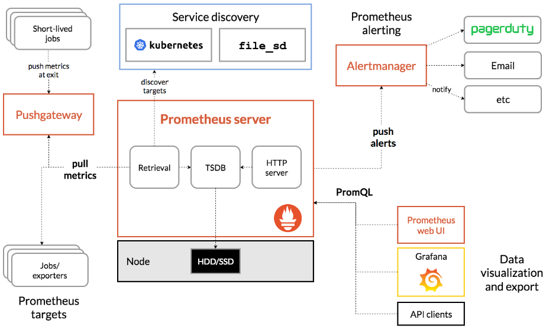

# Helm

Helm은 Kubernetes의 오브젝트들을 모아 하나의 패키지로 관리하기 위한 것이다.

``` bash
curl https://baltocdn.com/helm/signing.asc | gpg --dearmor | sudo tee /usr/share/keyrings/helm.gpg > /dev/null
sudo apt-get install apt-transport-https --yes
echo "deb [arch=$(dpkg --print-architecture) signed-by=/usr/share/keyrings/helm.gpg] https://baltocdn.com/helm/stable/debian/ all main" | sudo tee /etc/apt/sources.list.d/helm-stable-debian.list
sudo apt-get update
sudo apt-get install helm
```

``` bash
 vagrant@k8s-node1 > ~ > helm create mypkg         
Creating mypkg
 vagrant@k8s-node1 > ~/mypkg > tree
.
├── Chart.yaml
├── charts
├── templates
│   ├── NOTES.txt
│   ├── _helpers.tpl
│   ├── deployment.yaml
│   ├── hpa.yaml
│   ├── ingress.yaml
│   ├── service.yaml
│   ├── serviceaccount.yaml
│   └── tests
│       └── test-connection.yaml
└── values.yaml

 vagrant@k8s-node1 > ~ > helm package mypkg
Successfully packaged chart and saved it to: /home/vagrant/mypkg-0.1.0.tgz
```


# Monitoring & Logging

Prometheus는 성능, 사용성 및 다른 도구와의 호환성 등 여러 측면에서 우수하다고 평가되는 시계열 데이터베이스이다. 

그리고 DB에 수집된 데이터를 Grafana를 통해 시각화하거나, AlertManager를 통해 Slack 알람을 보내는 등 확장해 사용할 수 있다.

CAdvisor 같은 모니터링 에이전트 도구는 `/metrics` 경로를 외부에 노출시켜 제공한다. 이처럼 `/metrics` 경로를 외부에 노출시켜 데이터를 수집할 수 있도록 인터페이스를 제공하는 서비스를 일반적으로 exporter라고 부른다.

**exporter**

- 애플리케이션 내부의 데이터를 Prometheus로 수집하고 싶다면
  - Python, Golang 등에서 제공하는 exporter 라이브러리를 통해 커스텀 exporter 제작
- 필요에 맞는 적절한 오픈소스 exporter를 사용할 수 있으며, CAdvisor는 그러한 오픈소스 중 하나이다.

### 모니터링 메트릭의 분류

- 인프라 수준의 메트릭
  - 호스트에서 사용 중인 파일 디스크립터의 개수, 호스트에 마운트돼 있는 디스크 사용량, 호스트 NIC의 패킷 전송량 등
  - node-exporter 도구가 제공하는 메트릭
- 컨테이너 수준의 메트릭
  - 컨테이너별 CPU와 메모리 사용량, 컨테이너 프로세스의 상태, 컨테이너에 할당된 리소스 할당량, Kubernetes Pod의 상태 등
  - CAdvisor가 제공하는 메트릭
- 애플리케이션 수준의 메트릭
  - 마이크로서비스에서 발생하는 트레이싱 데이터, 애플리케이션 로직에 종속적인 데이터, 서버 프레임워크에서 제공하는 모니터링 데이터

## Prometheus Monitoring

CPU, Memory, Network IO, Disk IO

- Heapster + InfluxDB : X
  - metrics-server : DB 없음, 실시간
    - CPU, Memory
  - Prometheus


Prometheus는 데이터 수집을 Pulling 모델을 사용한다. 모니터링 대상이 되는 자원이 Metric 정보를 Prometheus로 보내는 것이 아니라, Prometheus가 주기적으로 모니터링 대상에서 Metric을 읽어오는 모델을 사용한다.

만약에 모니터링 대상이 Prometheus의 데이터 포맷을 지원하지 않을 경우 exporter를 통해 Metric을 읽어올 수 있다. 

또한 Push gateway를 사용할 수 있다. 배치나 스케쥴 작업의 경우 항상 서비스가 떠 있는 것이 아닌, 필요한 경우에만 떠 있다가 작업이 끝나면 사라지는 경우가 있다. 이러한 서비스를 Pulling으로 Metric을 얻어오기가 어려울 수 있ㄴ느데, 이를 보완하기 위해 Push 방식으로 Push gateway에 Metric을 전송하면 Push gateway가 Metric을 보관하고 있다가 Prometheus 서버가 Pulling을 할 때 저장된 Metric 정보를 리턴한다.

> https://github.com/prometheus-community/helm-charts/tree/main/charts/kube-prometheus-stack

``` bash
helm repo add prometheus-community https://prometheus-community.github.io/helm-charts
helm update
```

`prom-value.yaml`
``` yaml
grafana:
  service:
    type: LoadBalancer
```

``` bash
kubectl create ns monirot
```

``` bash
helm install prom prometheus-community/kube-prometheus-stack -f prom-values.yaml -n monitor
```

웹브라우저 http://192.168.100.24X
ID: admin
PWD: prom-operator

## EFK Logging

ELK Stack: Elasticsearch + Logstash + Kibana
EFK Stack: Elasticsearch + Fluentd + Kibana 
(Elasticsearch + Fluent Bit + Kibana)
Elastic Stack: Elasticsearch + Beat + Kibana

### Elasticsearch

ElasticSearch는 검색엔진이다. 데이터를 저장하는 저장소가 있고 그 데이터 저장소에서 검색한다. ElasticSearch를 로그를 저장하고 검색하는 용도로도 쓰긴하지만 기본 용도는 검색이다. 구글 검색과 같은 검색엔진을 만들 때 사용한다. 

``` bash
helm repo add elastic https://helm.elastic.co
helm repo update
```

``` bash
helm show values elastic/elasticsearch > es-value.yaml
```

`es-value.yaml`
``` yaml
 18 replicas: 1
 19 minimumMasterNodes: 1
 
 80 resources:
 81   requests:
 82     cpu: "500m"
 83     memory: "1Gi"
 84   limits:
 85     cpu: "500m"
 86     memory: "1Gi"
```

``` bash
kubectl create ns logging
```

``` bash
helm install elastic elastic/elasticsearch -f es-value.yaml -n logging
```

### Fluent Bit

Fluent Bit의 역할을 Logging을 하는 것이다. Fluent Bit가 여러 로그 파일들을 수집한다. 그리고 수집한 로그 파일들을 ElasticSearch에게 전송한다.

> https://github.com/fluent/fluent-bit-kubernetes-logging

``` bash
git clone https://github.com/fluent/fluent-bit-kubernetes-logging.git
```

``` bash
cd fluent-bit-kubernetes-logging
```

``` bash
kubectl create -f fluent-bit-service-account.yaml
kubectl create -f fluent-bit-role-1.22.yaml
kubectl create -f fluent-bit-role-binding-1.22.yaml
```

``` bash
kubectl create -f output/elasticsearch/fluent-bit-configmap.yaml
```

`output/elasticsearch/fluent-bit-ds.yaml`
``` yaml
 32         - name: FLUENT_ELASTICSEARCH_HOST
 33           value: "elasticsearch-master"
```

``` bash
kubectl create -f output/elasticsearch/fluent-bit-ds.yaml
```

### Kibana

로그를 시각적으로 관리한다.

``` bash
helm show values elastic/kibana > kibana-value.yaml
```

`kibana-value.yaml`
``` yaml
 49 resources:
 50   requests:
 51     cpu: "500m"
 52     memory: "1Gi"
 53   limits:
 54     cpu: "500m"
 55     memory: "1Gi"
 
 119 service:
 120   type: LoadBalancer
```

``` bash
helm install kibana elastic/kibana -f kibana-value.yaml -n logging
```

http://192.168.100.X:5601

- 햄버거 -> Management -> Stack Management
  - Kibana -> Index Pattern
    - Create Index Pattern 우상
        - Name: logstash-*
        - Timestamp: @timestamp
- 햄버거 -> Analystics -> Discover