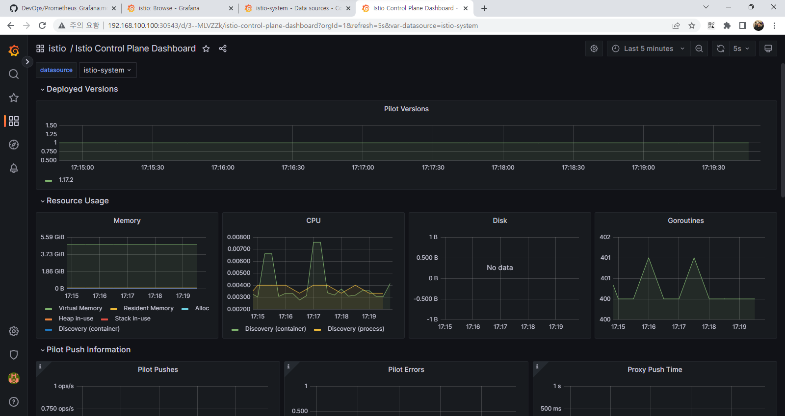
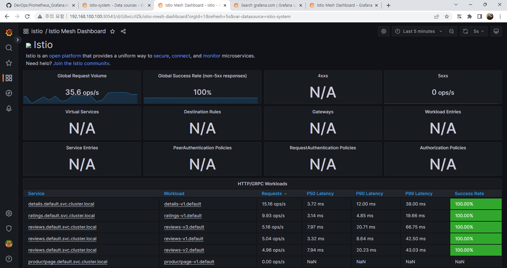
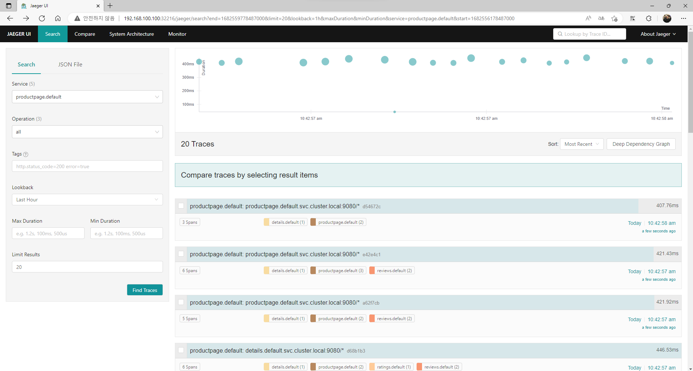
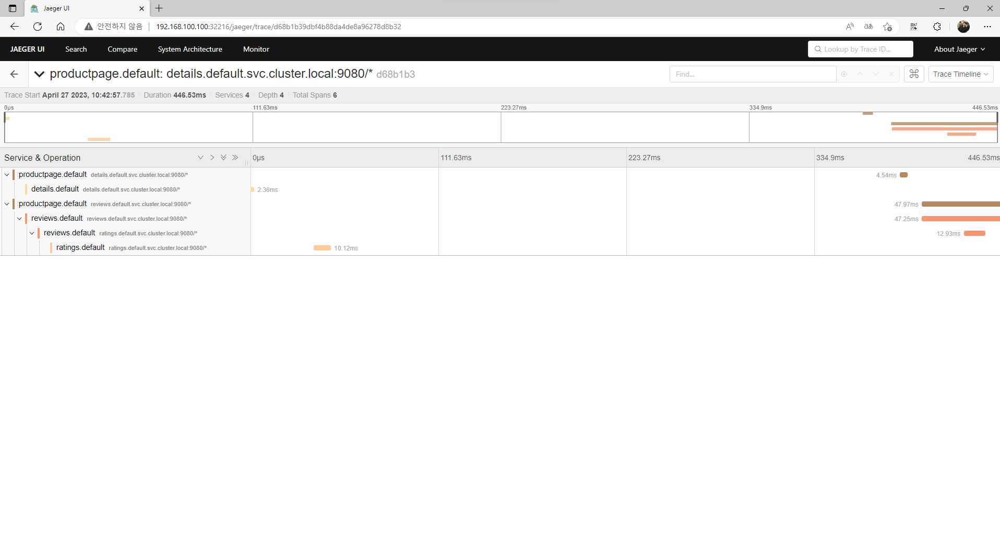
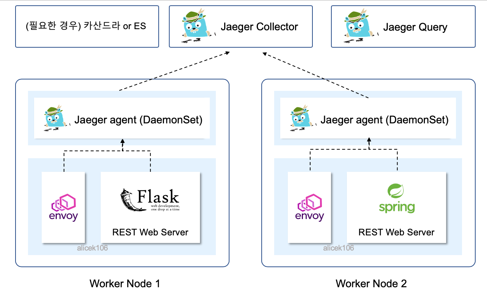
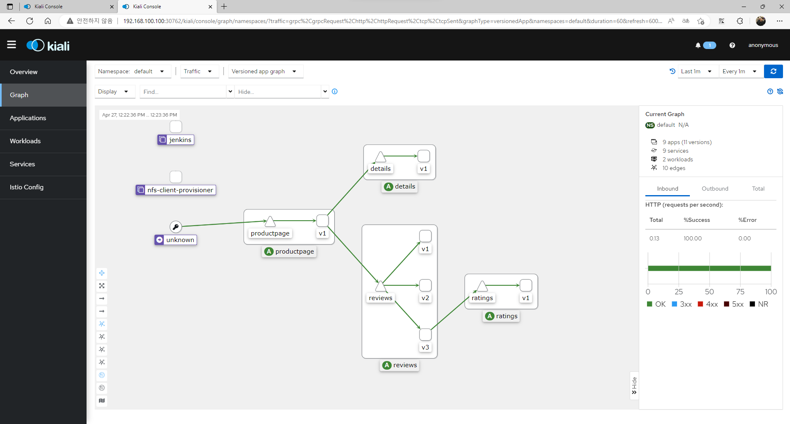

# Istio

현재는 샘플 Bookinfo 예제와, 개요 수준으로 다루었지만 추후 프로젝트 시 참조 넣도록 하겠다.

> https://www.istioworkshop.io/
> 
> https://github.com/istio/istio

Istio는 Kubernetes 환경에서 서비스 메시를 관리하기 위한 오프소스 플랫폼이다. Envoy를 기반으로 하며, 서비스 간 트래픽 관리, 인증 및 권한 부여, 서비스 모니터링, 로깅 등 다양한 기능을 제공한다.

1. 서비스 메시 구성

Istio는 Kubernetes 상에서 Envoy 프록시를 이용하여 서비스 간의 통신을 관리한다. 서비스 메시 구성은 Istio의 제어 평면에서 이루어지며, 다양한 라우팅 규칙, 트래픽 분산 방식, 롤릴 업데이트 등을 설정할 수 있다.

2. 인증 및 권한 부여

Istio는 서비스 간 통신에 대한 보안을 제공한다. mTLS 기반의 보안 통신을 지원하며, 인증 및 권한 부여를 위한 다양한 기능을 제공한다.

3. 서비스 모니터링

Istio는 서비스 메시에서 발생하는 트래픽을 모니터링하고, Prometheus와 Grafana를 이용하여 대시보드를 제공한다. 이를 통해 소비스 메시의 상태를 실시간으로 확인할 수 있다.

4. 로깅

Istio는 서비스 메시에서 발생하는 로그를 수집하고, Fluntd 또는 Fluent Bit와 같은 로그 수집 도구와 연동하여 로그 분석을 가능하게 한다.

5. 서비스 메시 확장

Istio는 Kubernetes 환경에서 서비스 메시를 확장하는 다양한 기능을 제공한다. 예를 들어, 서비스 메시 확장을 위한 Auto Scaling, Traffic Splitting 등을 지원한다.

## Install

``` bash
mkdir ~/istio && cd ~/istio
```

최신 버전 설정

> https://github.com/istio/istio

``` bash
export ISTIO_VERSION=1.17.2
```

``` bash
curl -L https://git.io/getLatestIstio | sh -
```

PATH에 istioctl 추가
``` bash
export PATH="$PATH:~/istio-$ISTIO_VERSION/bin"
```

``` bash
 vagrant@k8s-node1  ~/istio  istioctl version --remote=false
1.17.2
```


하기 설치의 경우 demo를 사용한다.
``` bash
 vagrant@k8s-node1  ~/istio  istioctl install --set profile=demo -y
✔ Istio core installed                                                        
✔ Istiod installed                                                            
✔ Egress gateways installed                                                   
✔ Ingress gateways installed                                                  
✔ Installation complete                                                       
```

namespace label을 추가하여 Istio에 Envoy를 자동으로 삽입
``` bash
kubectl label namespace default istio-injection=enabled
```

## Visualizing Metrics with Grafana

서비스 mesh traffic을 확인하기 위해 Istio Dashboard를 활용한다. Grafana, Prometheus의 Addon을 설치하고, Bookinfo의 예제를 통해 확인해보겠다.

### 샘플 Prometheus 설치
``` bash
kubectl apply -f https://raw.githubusercontent.com/istio/istio/release-1.17/samples/addons/prometheus.yaml

kubectl patch svc prometheus -n istio-system -p '{"spec": {"type": "NodePort"}}'
```

상기 설정 및 기존 Grafana 대시보드 내 Data Source 추가

하기와 같이 성공적으로 배포 확인 가능



> 일반적으로 하나의 Kubernetes 클러스터 내에서 여러 개의 Prometheus를 사용하는 것은 좋지 않다. 클러스터 리소스를 낭비하고 복잡성을 증가시킬 수 있다.

### Bookinfo

Bookinfo Application은 4개의 Micro Service로 나뉜다.

- productpage: Micro Service를 호출
- details: book info
- reviews: book reviews
- ratings: book ranking

아키텍처는 하기와 같다.


### Deploy Bookinfo

기본 Istio 설치는 automatic sidecar injection을 사용한다. label은 하기와 같이 `istio-injection=enabled`로 설정한다.

``` bash
kubectl label namespace default istio-injection=enabled
```

``` bash
kubectl apply -f ./istio-1.17.2/samples/bookinfo/platform/kube/bookinfo.yaml
```

``` bash
kubectl patch svc productpage -p '{"spec": {"type": "NodePort"}}'
```

### Traffic 전송

Bookinfo에 요청을 보내 트래픽을 확인한다.


``` bash
while true;do curl http://192.168.100.100:30241/productpage; done
```



상기와 같이 Service Mesh를 확인할 수 있다.

## Jaeger

### Tracing

Tracing은 복잡한 MSA 서버 사이에서 insight를 제공한다. 뿐만 아니라, 서버 내부의 어느 함수에서 시간을 많이 소요하는지, 어느 경우에 레이턴시가 튀는지 등을 확인하기 위한 용도로 쓰인다.

- HTTP, gRPC 등의 프로토콜을 사용ㅇ하는 서버 간의 요청 추적
- 서버 내부 프로세싱의 추적

### Tracing을 위한 솔루션과 Service Mesh

트레이싱 데이터를 수집하려면 서버 간에 HTTP 헤더를 전파하거나, 서버로 들어오는 요청의 프로토콜 등을 aware할 수 있는 무언가가 필요하다. 때문에 이를 해결하기 위해 Istio와 같은 Service Mesh 솔루션을 활용한다.

### Jaeger + Istio를 이용한 Server Tracing 구축

**Bookinfo 예제**

Jaeger Install
``` bash
kubectl apply -f https://raw.githubusercontent.com/istio/istio/release-1.17/samples/addons/jaeger.yaml

kubectl patch svc tracing -n istio-system -p '{"spec": {"type": "NodePort"}}'
```

``` bash
while true;do curl http://192.168.100.100:30241/productpage; done
```



Find Traces의 Service를 `productpage.default` 선택

맨 위에 있는 가장 최근 추적을 클릭하면 해당 세부 정보 확인 가능



### Jaeger 컴포넌트 및 구조

- query: Jaeger에 수집된 데이터를 시각화해주는 Web UI 서버
- collector: 실제로 데이터가 수집되는 Jaeger 핵심 서버. 수집된 Jaeger 데이터를 저장하기 위해 [로컬 스토리지, 인메모리, Elastic Search, 카산드라, Kafka] 총 4가지 중 하나를 선택해 사용해야 한다. Kafka로 데이터를 보낼 경우 ingester라는 별도의 Jaeger 컴포넌트를 comsumer로서 deploy 한 다음, Elastic Search 또는 카산드라 백엔드로 보내야 한다.
- agent: Envoy, Flask, Sping 등과 같은 데이터 소스가 데이터를 전송하기 위한 중간 서버


**Jaeger Architecture**

1. All In One Docker Image로 Jaeger 사용

이 경우에는 Jaeger의 데이터를 저장할 백엔드 스토리지를 local storage를 사용할 수 있어 간편하게 사용할 수 있으며, 애플리케이션 서버가 바라보는 Jaeger엔드포인트가 all in one 하나로 고정된다는 장점이 있다. 하지만 경우에 따라 SPOF가 될 수 있다.


2. collector + query + agent 방식의 Jaeger

실제 프로덕션 환경에서 권장되는 방식이다. 이 경우에는 Tracing 데이터가 [데이터 소스 -> agent -> collector] 순으로 흘러가게 되며, Envoy나 Sping, Flask 등의 애플리케이션 서버에서 바라보게 되는 Jaeger 엔드포인트는 collector가 아닌 agent가 된다.



agent는 각 워커 노드에 배포되는 DaemonSet일 수 있고, 각 애플리케이션 서버에 Sidecar로 배포되는 형태일 수 있다. 전자의 경우에는 hostNetwork를 요구하는 Pod로서 agent를 배포하기 때문에 node IP의 downward 값이 엔드포인트가 되고, 후자의 경우에는 pod network Sandbox인 localhost가 엔드포인트가 된다.

## Visualize Mesh

Kiali는 웹 대시보드 형태로 Istio 정책을 제어하고 Istio 동작을 확인할 수 있는 기능을 지원한다.

### Kiali Install

``` bash
kubectl apply -f https://raw.githubusercontent.com/istio/istio/release-1.17/samples/addons/kiali.yaml

kubectl patch svc kiali -n istio-system -p '{"spec": {"type": "NodePort"}}'
```

``` bash
while true;do curl http://192.168.100.100:30241/productpage; done
```




상기와 같이 그래프는 Istio Telemetry를 사용하여 일정 기간 동안 Service Mesh를 통과하는 트래픽을 보여준다.
