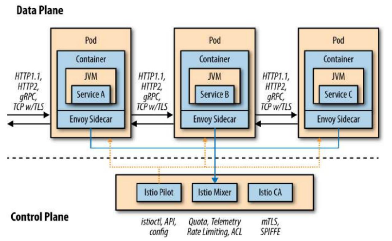
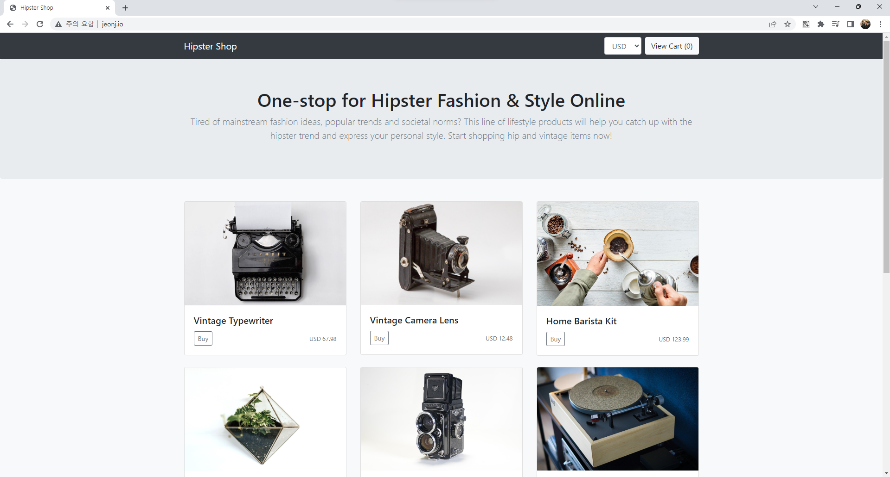
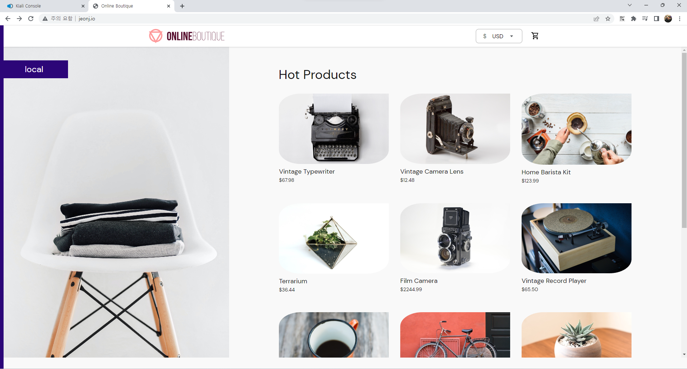
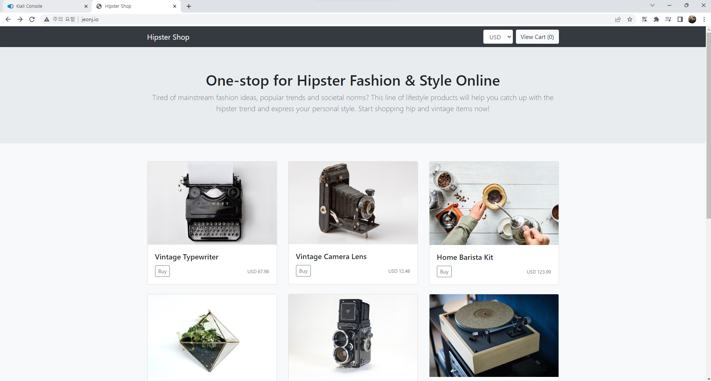

# Istio

## Istio 구성 요소 이해

Istio 서비스 메시는 주로 데이터 플레인과 컨트롤 플레인의 두 가지 영역으로 구성되며 하기 그림에 나와 있다.



그림. 데이터 플레인과 컨트롤 플레인

### 데이터 플레인

모든 인바운드 및 아웃바운드 네트워크 트래픽을 가로채는 방식으로 구현된다. Istio 서비스 메시의 데이터 플레인은 서비스 프록시와 사이드카 컨테이너라는 두 가지 개념으로 구성된다. 

**서비스 프록시**

서비스 프록시는 애플리케이션 서비스가 추가 기능에 의존하는 프록시이다. 서비스는 외부 세계와 통신해야 할 때마다 서비스 프록시를 통해 호출한다. 프록시는 자동 재시도, 시간 초과, 회로 차단기, 서비스 검색, 보안 등과 같은 기능을 추가할 수 있는 중개자 또는 인터셉터 역할을 한다. Istio의 기본 서비스 프록시는 Envoy 프록시를 기반으로 한다.

Envoy Proxy는 Layer 7 프록시이다. HTTP 1.1, HTTP2, gRPC에 대한 로드밸런싱, 요청 수준 메트릭 수집 기능, 범위 추적, 활성 및 수동 상태 확인, 서비스 검색 등의 기능을 제공한다.

Istio는 사이드카 배포를 통해 서비스 프록시 기능을 애플리케이션 코드에 가깝게 제공한다.

### 컨트롤 플레인

컨트롤 플레인은 구성 및 정책에 대한 권힌 있는 소스가 여러 노드에 분산된 수백 개의 Pod로 잠재적으로 구성된 클러스터에서 데이터 플레인을 사용할 수 있도록 만드는 역할을 한다. Istio의 컨트롤 플레인은 Pilot, Mixer, CA 세 가지 기본 Istio 서비스로 구성된다.

**Pilot**

Pilot은 Kubernetes 클러스터에서 실행되는 모든 마이크로서비스의 관리 책임이 있다. Pilot은 RouteRule 및 DestinationPolicy에 대한 지원뿐만 아니라 서비스 검색과 같은 기능을 제공한다.

**Mixer**

Mixer는 모든 것을 하나로 모으는 Istio 서비스이다. 각 분산된 istio-proxy는 분석을 Mixer로 전달한다. 또한 Pod의 전체에 대한 사용 및 액세스 정책의 표준 모델을 유지한다. Mixer를 사용하면 ACL을 생성하고 속도 제한 규칙을 적용하고 사용자 정의 metrics를 캡처할 수도 있다. 

**CA**

Istio Auth 구성 요소는 인증서 서명, 인증서 발급 및 해지/순환을 담당한다. Istio는 모든 마이크로서비스에 x509 인증서를 발급하여 해당 서비스 간에 상호 전송 계층 보안(mTLS)을 허용하고 모든 트래픽을 투명하게 암호화한다. 기본 배포 플랫폼에 내장된 ID를 사용하고 이를 인증서에 구축한다. 

현재는 샘플 Bookinfo 예제와, 개요 수준으로 다루었지만 추후 프로젝트 시 참조 넣도록 하겠다.

> https://www.istioworkshop.io/
>
> https://github.com/GoogleCloudPlatform/microservices-demo
>
> https://github.com/rafik8/istio-workshop-labs
> 
> https://github.com/istio/istio

Istio는 Kubernetes 환경에서 서비스 메시를 관리하기 위한 오프소스 플랫폼이다. Envoy를 기반으로 하며, 서비스 간 트래픽 관리, 인증 및 권한 부여, 서비스 모니터링, 로깅 등 다양한 기능을 제공한다.

1. 서비스 메시 구성

Istio는 Kubernetes 상에서 Envoy 프록시를 이용하여 서비스 간의 통신을 관리한다. 서비스 메시 구성은 Istio의 제어 평면에서 이루어지며, 다양한 라우팅 규칙, 트래픽 분산 방식, 롤릴 업데이트 등을 설정할 수 있다.

2. 인증 및 권한 부여

Istio는 서비스 간 통신에 대한 보안을 제공한다. mTLS 기반의 보안 통신을 지원하며, 인증 및 권한 부여를 위한 다양한 기능을 제공한다.

3. 서비스 모니터링

Istio는 서비스 메시에서 발생하는 트래픽을 모니터링하고, Prometheus와 Grafana를 이용하여 대시보드를 제공한다. 이를 통해 소비스 메시의 상태를 실시간으로 확인할 수 있다.

4. 로깅

Istio는 서비스 메시에서 발생하는 로그를 수집하고, Fluntd 또는 Fluent Bit와 같은 로그 수집 도구와 연동하여 로그 분석을 가능하게 한다.

5. 서비스 메시 확장

Istio는 Kubernetes 환경에서 서비스 메시를 확장하는 다양한 기능을 제공한다. 예를 들어, 서비스 메시 확장을 위한 Auto Scaling, Traffic Splitting 등을 지원한다.

## Install

최신 버전 설정

> https://github.com/istio/istio

``` bash
export ISTIO_VERSION=1.17.2
```

``` bash
curl -L https://git.io/getLatestIstio | sh -
```

PATH에 istioctl 추가
``` bash
export PATH="$PATH:/home/vagrant/istio-$ISTIO_VERSION/bin"
```

``` bash
 vagrant@k8s-node1 > ~/istio > istioctl version --remote=false
1.17.2
```


하기 설치의 경우 demo를 사용한다.
``` bash
 vagrant@k8s-node1 > ~/istio > istioctl install --set profile=demo -y
✔ Istio core installed                                                        
✔ Istiod installed                                                            
✔ Egress gateways installed                                                   
✔ Ingress gateways installed                                                  
✔ Installation complete                                                       
```

namespace label을 추가하여 Istio에 Envoy를 자동으로 삽입
``` bash
kubectl label namespace default istio-injection=enabled
```

## Visualizing Metrics with Grafana

서비스 mesh traffic을 확인하기 위해 Istio Dashboard를 활용한다. Grafana, Prometheus의 Addon을 설치하고, Bookinfo의 예제를 통해 확인해보겠다.

### 샘플 Prometheus 설치
``` bash
kubectl apply -f https://raw.githubusercontent.com/istio/istio/release-1.17/samples/addons/prometheus.yaml

kubectl patch svc prometheus -n istio-system -p '{"spec": {"type": "NodePort"}}'
```

상기 설정 및 기존 Grafana 대시보드 내 Data Source 추가

하기와 같이 성공적으로 배포 확인 가능


> 일반적으로 하나의 Kubernetes 클러스터 내에서 여러 개의 Prometheus를 사용하는 것은 좋지 않다. 클러스터 리소스를 낭비하고 복잡성을 증가시킬 수 있다.

### Bookinfo

Bookinfo Application은 4개의 Micro Service로 나뉜다.

- productpage: Micro Service를 호출
- details: book info
- reviews: book reviews
- ratings: book ranking

아키텍처는 하기와 같다.


### Deploy Bookinfo

기본 Istio 설치는 automatic sidecar injection을 사용한다. label은 하기와 같이 `istio-injection=enabled`로 설정한다.

``` bash
kubectl label namespace default istio-injection=enabled
```

``` bash
kubectl apply -f ./istio-1.17.2/samples/bookinfo/platform/kube/bookinfo.yaml
```

``` bash
kubectl patch svc productpage -p '{"spec": {"type": "NodePort"}}'
```

### Traffic 전송

Bookinfo에 요청을 보내 트래픽을 확인한다.


``` bash
while true;do curl http://192.168.100.100:30241/productpage; done
```


상기와 같이 Service Mesh를 확인할 수 있다.

## Jaeger

### Tracing

Tracing은 복잡한 MSA 서버 사이에서 insight를 제공한다. 뿐만 아니라, 서버 내부의 어느 함수에서 시간을 많이 소요하는지, 어느 경우에 레이턴시가 튀는지 등을 확인하기 위한 용도로 쓰인다.

- HTTP, gRPC 등의 프로토콜을 사용ㅇ하는 서버 간의 요청 추적
- 서버 내부 프로세싱의 추적

### Tracing을 위한 솔루션과 Service Mesh

트레이싱 데이터를 수집하려면 서버 간에 HTTP 헤더를 전파하거나, 서버로 들어오는 요청의 프로토콜 등을 aware할 수 있는 무언가가 필요하다. 때문에 이를 해결하기 위해 Istio와 같은 Service Mesh 솔루션을 활용한다.

### Jaeger + Istio를 이용한 Server Tracing 구축

**Bookinfo 예제**

Jaeger Install
``` bash
kubectl apply -f https://raw.githubusercontent.com/istio/istio/release-1.17/samples/addons/jaeger.yaml

kubectl patch svc tracing -n istio-system -p '{"spec": {"type": "NodePort"}}'
```

``` bash
while true;do curl http://192.168.100.100:30241/productpage; done
```


Find Traces의 Service를 `productpage.default` 선택

맨 위에 있는 가장 최근 추적을 클릭하면 해당 세부 정보 확인 가능


### Jaeger 컴포넌트 및 구조

- query: Jaeger에 수집된 데이터를 시각화해주는 Web UI 서버
- collector: 실제로 데이터가 수집되는 Jaeger 핵심 서버. 수집된 Jaeger 데이터를 저장하기 위해 [로컬 스토리지, 인메모리, Elastic Search, 카산드라, Kafka] 총 4가지 중 하나를 선택해 사용해야 한다. Kafka로 데이터를 보낼 경우 ingester라는 별도의 Jaeger 컴포넌트를 comsumer로서 deploy 한 다음, Elastic Search 또는 카산드라 백엔드로 보내야 한다.
- agent: Envoy, Flask, Sping 등과 같은 데이터 소스가 데이터를 전송하기 위한 중간 서버


**Jaeger Architecture**

1. All In One Docker Image로 Jaeger 사용

이 경우에는 Jaeger의 데이터를 저장할 백엔드 스토리지를 local storage를 사용할 수 있어 간편하게 사용할 수 있으며, 애플리케이션 서버가 바라보는 Jaeger엔드포인트가 all in one 하나로 고정된다는 장점이 있다. 하지만 경우에 따라 SPOF가 될 수 있다.


2. collector + query + agent 방식의 Jaeger

실제 프로덕션 환경에서 권장되는 방식이다. 이 경우에는 Tracing 데이터가 [데이터 소스 -> agent -> collector] 순으로 흘러가게 되며, Envoy나 Sping, Flask 등의 애플리케이션 서버에서 바라보게 되는 Jaeger 엔드포인트는 collector가 아닌 agent가 된다.


agent는 각 워커 노드에 배포되는 DaemonSet일 수 있고, 각 애플리케이션 서버에 Sidecar로 배포되는 형태일 수 있다. 전자의 경우에는 hostNetwork를 요구하는 Pod로서 agent를 배포하기 때문에 node IP의 downward 값이 엔드포인트가 되고, 후자의 경우에는 pod network Sandbox인 localhost가 엔드포인트가 된다.

## Visualize Mesh

Kiali는 웹 대시보드 형태로 Istio 정책을 제어하고 Istio 동작을 확인할 수 있는 기능을 지원한다.

### Kiali Install

``` bash
kubectl apply -f https://raw.githubusercontent.com/istio/istio/release-1.17/samples/addons/kiali.yaml

kubectl patch svc kiali -n istio-system -p '{"spec": {"type": "NodePort"}}'
```

``` bash
while true;do curl http://192.168.100.100:30241/productpage; done
```


상기와 같이 그래프는 Istio Telemetry를 사용하여 일정 기간 동안 Service Mesh를 통과하는 트래픽을 보여준다.

## Hipster application

Istio workshop 내의 Web demo 애플리케이션이다.

> https://github.com/GoogleCloudPlatform/microservices-demo

이 Application은 10개의 서로 다른 Micro Service로 구성되어 있어 시나리오에서 Istio 기능을 사용 및 테스트하고 Micro Service를 학습용으로 선택하였다.


``` bash
kubectl create ns hipster-app

# Kubernetes context를 생성된 NS로 설정
# 혹은 kubens 사용
kubectl config set-context --current --namespace=hipster-app
```

> kubectx 및 kubens install
> sudo git clone https://github.com/ahmetb/kubectx /opt/kubectx
> sudo ln -s /opt/kubectx/kubectx /usr/local/bin/kubectx
> sudo ln -s /opt/kubectx/kubens /usr/local/bin/kubens

``` bash
# microservices-demo/release/kubernetes-manifests.yaml
kubectl apply -f kubernetes-manifests.yaml

kubectl get po,svc
```

**Istio에서 Service Mesh를 가능하게 하는 3가지 방법**

- **자동 사이드카 삽입**

Mutating Admission Webhook을 통한 자동 사이트가 삽입, namespace가 `istio-injection=enabled` 레이블이 지정되면 namespace에 배포된 모든 Pod는 `sidecar-injector` Pod에서 삽입한 카이드카를 가져온다.

- **수동 사이드카 추가**

deployment에 사이드카 추가

``` bash
istioctl kube-inject -f deployment.yaml
```

- **단일 Pod 삽입**

특정 서비스에 대해서만 Mesh를 활성화하고, Istio와의 호환성 테스트를 시작하는 경우에 유용

``` bash
istioctl experimental add-to-mesh service [flags]
```

### Hipster Application에 Istio 활성화

Envoy Proxy 삽입
``` bash
kubectl apply -f <(istioctl kube-inject -f hipster-app.yaml)
```

Application에 Istio를 활성화함으로써 Code를 수정하거나 컨테이너 이미지를 다시 빌드할 필요 없이 Grafana, Jaeger, Kiali를 통해 애플리케이션 모니터링 및 Tracing 기능을 사용할 수 있다.

## Traffic Management

Istio Gateway는 Envoy Proxy를 기반으로 하며, Service Mesh 네트워크에서 실행되며 서비스에 대한 역방향 프록시 및 로드 밸런싱을 처리한다.


### Istio Gateway vs. Kubernetes Gateway

Kubernetes Ingress와 달리 Istio Ingress는 트래픽 라우팅 구성이 포함되어 있지 않다. 수신 트래픽에 대한 트래픽 라우팅은 내부 서비스 요청과 정확히 동일한 Istio 라우팅 규칙을 사용하여 구성된다.

### Ingress resource

실제로 Hipster Application은 CSP가 제공하는 Kubernetes 컨트롤러인 LoadBalancer를 사용하여 외부에 노출된다.

> 현재는 VM 환경에서 MetalLB로 구성

``` bash
vagrant@k8s-node1 > ~ > kubectl get service istio-ingressgateway -o jsonpath='{.status.loadBalancer.ingress[0].ip}' -n istio-system
192.168.100.241

vagrant@k8s-node1 > ~ > curl 192.168.100.241
curl: (7) Failed to connect to 192.168.100.241 port 80: Connection refused
```

상기와 같은 에러는 수신 게이트웨이 뒤에서 실행 중인 서비스가 없기 때문에 연결이 거부된다.

도메인 네임을 Ingress Gateway에 연결하도록 Cloud DNS를 설정한다.

> VM 환경이기에, `/etc/hosts` 내 `192.168.100.241 jeonj.io`를 추가함

``` bash
kubectl apply -f frontend-ingress.yaml

 vagrant@k8s-node1 > ~/istio/istio-workshop-labs >  master ± > kubectl get virtualservice,gateway
NAME                                                         GATEWAYS          HOSTS          AGE
virtualservice.networking.istio.io/frontend-virtualservice   ["app-gateway"]   ["jeonj.io"]   36s

NAME                                      AGE
gateway.networking.istio.io/app-gateway   36s
```



## Ingress Gateway Exercise

- **Kiali**: dashboard.test01-jeonj.io/kiali
- **Jaeger Tracing**: tracing.test01-jeonj.io

Istio addon에 대한 Gateway 및 Kiali, Jaeger를 위한 VirtualService 배포

``` yaml
apiVersion: networking.istio.io/v1alpha3
kind: Gateway
metadata:
  name: addons-gateway
spec:
  selector:
    istio: ingressgateway # use istio default controller
  servers:
  - port:
      number: 80
      name: http
      protocol: HTTP
    hosts:
    - "dashboard.test01-jeonj.io"
---
apiVersion: networking.istio.io/v1alpha3
kind: VirtualService
metadata:
  name: kiali
spec:
  hosts:
  - "dashboard.test01-jeonj.io"
  gateways:
  - addons-gateway
  http:
  - match:
    - uri:
        prefix: /kiali
    route:
    - destination:
        host: kiali
        port:
          number: 20001
---
apiVersion: networking.istio.io/v1alpha3
kind: VirtualService
metadata:
  name: tracing
spec:
  hosts:
  - "dashboard.test01-jeonj.io"
  gateways:
  - addons-gateway
  http:
  - match:
    - uri:
        prefix: /jaeger
    route:
    - destination:
        host: tracing
        port:
          number: 80
```

### Traffic Splitting


- **VirtualService**: 호스트 주소가 지정될 떄 적용할 트래픽 라우팅 규칙 집합 정의
- **DestinationRule**: 라우팅이 발생한 후 서비스에 대한 트래픽에 적용되는 정책 정의


**VirtualService**
``` yaml
apiVersion: networking.istio.io/v1alpha3
kind: VirtualService
metadata:
  name: service-a
spec:
  hosts:
    - service-a
  http:
    - route:
        - destination:
            host: service-a
            subset: v1
          weight: 80
        - destination:
            host: service-a
            subset: v2
          weight: 20
```

**DestinationRule**
``` yaml
apiVersion: networking.istio.io/v1alpha3
kind: DestinationRule
metadata:
  name: property-business-service
spec:
  host: property-business-service
  subsets:
    - name: v1
      labels:
        version: "1.0"
    - name: v2
      labels:
        version: "1.1"
```

``` bash
kubectl apply -f <(istioctl kube-inject -f frontend-0.1.3.yaml)
```

`VirtualService`
``` yaml
  http:
  - match:
    - uri:
        prefix: /
    route:
    - destination:
        host: frontend
        port:
          number: 80
        subset: v1
      weight: 80
    - destination:
        host: frontend
        port:
          number: 80
        subset: v2
      weight: 20
```

``` bash
kubectl apply -f frontend-virtualservice.yaml
kubectl apply -f frontend-destinationrule.yaml
```






### 결론

Istio는 DevOps와 SRE에 상기 Tool을 도입하여 개발팀을 대신하여 네트워크 문제를 관리함으로써 집중할 수 있도록 한다.