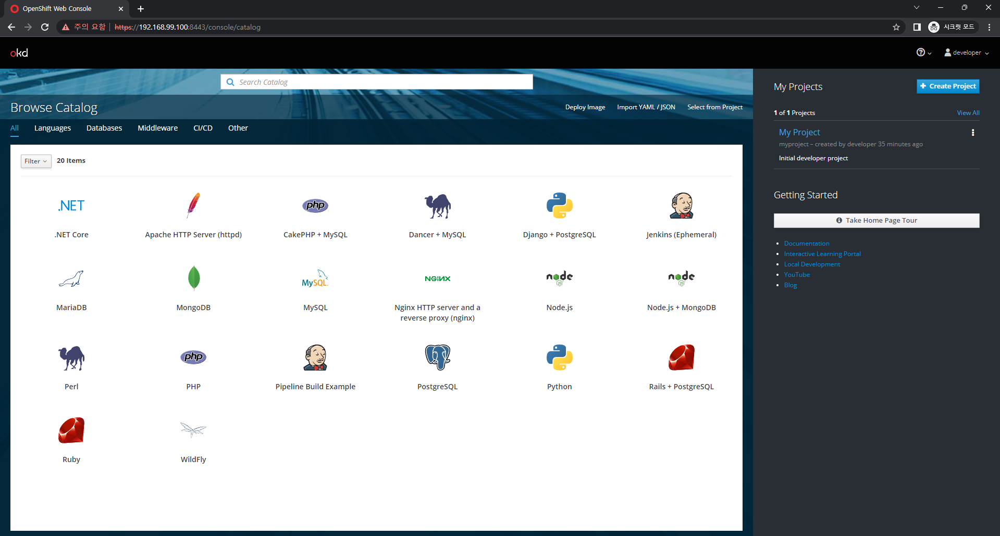
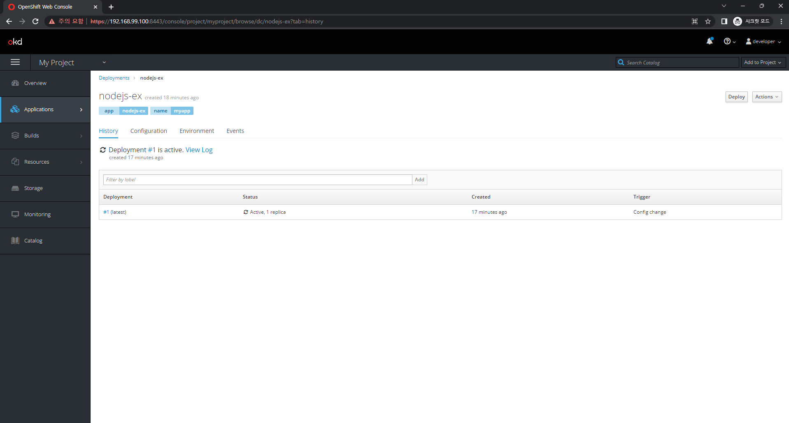
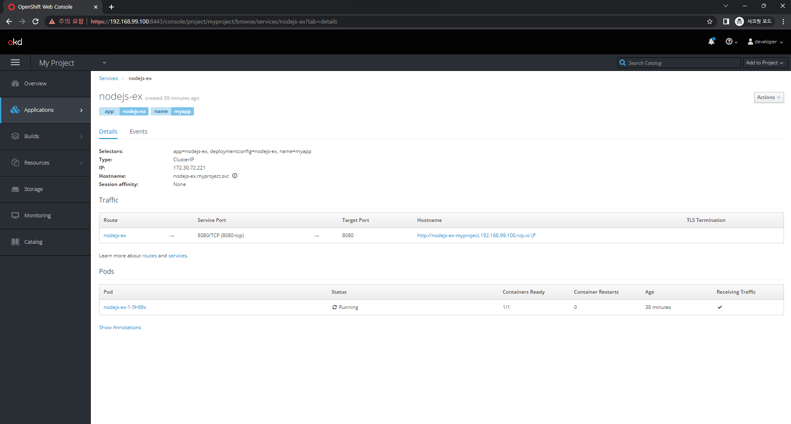

# Minishift

Minishift는 개발자들이 OpenShift를 로컬 환경에서 테스트하고 실행할 수 있도록 도와주는 도구이다. OpenShift는 Kubernetes 기반의 컨테이너 오케스트레이션 플랫폼으로, 개발자들이 애플리케이션을 빌드, 배포 및 관리하기 위한 다양한 기능을 제공한다.

Minishift는 이러한 OpenShift 기능을 로컬 개발환경에서 테스트하기 위한 플랫폼이다. 개발자들은 Minishift를 사용하여 로컬 환경에서 애플리케이션을 빌드하고 배포하며, 다양한 환경을 시뮬레이션하고 애플리케이션을 테스트할 수 있다.

> https://github.com/minishift/minishift/releases

Windows 버전에는 사용자의 홈 디렉토리가 있는 드라이브에 설치를 해야 한다.

> https://github.com/minishift/minishift/issues/236

``` bash
C:\minishift>minishift.exe start --vm-driver virtualbox
```
``` bash
C:\minishift>minishift.exe ip
192.168.99.100

C:\minishift>minishift.exe status
Minishift:  Running
Profile:    minishift
OpenShift:  Running (openshift v3.11.0+07ae5a0-606)
DiskUsage:  21% of 19G (Mounted On: /mnt/sda1)
CacheUsage: 1.711 GB (used by oc binary, ISO or cached images)
```

## OpenShift Client Binary 사용

`minishift oc-env` 명령을 실행하면, oc를 사용하기 위한 설정 명령어를 출력한다. Windows의 경우 출력의 마지막 줄에서 REM을 제거한 명령어를 실행한다.

``` bash
C:\minishift>minishift oc-env
SET PATH=C:\Users\jeonj\.minishift\cache\oc\v3.11.0\windows;%PATH%
REM Run this command to configure your shell:
REM     @FOR /f "tokens=*" %i IN ('minishift oc-env') DO @call %i

C:\>@FOR /f "tokens=*" %i IN ('minishift oc-env') DO @c

C:\minishift>oc status
In project My Project (myproject) on server https://192.168.99.100:8443
```

## 샘플 애플리케이션 배포

`oc new-app https://github.com/openshift/nodejs-ex -l name=myapp`

``` bash
C:\minishift>oc new-app https://github.com/openshift/nodejs-ex -l name=myapp
--> Found image 93de123 (4 years old) in image stream "openshift/nodejs" under tag "10" for "nodejs"

    Node.js 10.12.0
    ---------------
    Node.js  available as docker container is a base platform for building and running various Node.js  applications and frameworks. Node.js is a platform built on Chrome's JavaScript runtime for easily building fast, scalable network applications. Node.js uses an event-driven, non-blocking I/O model that makes it lightweight and efficient, perfect for data-intensive real-time applications that run across distributed devices.

    Tags: builder, nodejs, nodejs-10.12.0

    * The source repository appears to match: nodejs
    * A source build using source code from https://github.com/openshift/nodejs-ex will be created
      * The resulting image will be pushed to image stream tag "nodejs-ex:latest"
      * Use 'start-build' to trigger a new build
    * This image will be deployed in deployment config "nodejs-ex"
    * Port 8080/tcp will be load balanced by service "nodejs-ex"
      * Other containers can access this service through the hostname "nodejs-ex"

--> Creating resources with label name=myapp ...
    imagestream.image.openshift.io "nodejs-ex" created
    buildconfig.build.openshift.io "nodejs-ex" created
    deploymentconfig.apps.openshift.io "nodejs-ex" created
    service "nodejs-ex" created
--> Success
    Build scheduled, use 'oc logs -f bc/nodejs-ex' to track its progress.
    Application is not exposed. You can expose services to the outside world by executing one or more of the commands below:
     'oc expose svc/nodejs-ex'
    Run 'oc status' to view your app.
```

``` bash
C:\minishift>oc status
In project My Project (myproject) on server https://192.168.99.100:8443

http://nodejs-ex-myproject.192.168.99.100.nip.io to pod port 8080-tcp (svc/nodejs-ex)
  dc/nodejs-ex deploys istag/nodejs-ex:latest <-
    bc/nodejs-ex source builds https://github.com/openshift/nodejs-ex on openshift/nodejs:10
    deployment #1 deployed 12 minutes ago - 1 pod


2 infos identified, use 'oc status --suggest' to see details.
```

`https://192.168.99.100:8443/console/`에 접속한 후, Username `developer`, Password `developer`로 로그인한다.




`My Project`는 OpenShift가 자동으로 만드는 기본 프로젝트이다.

또한 하기와 같이 name 레이블이 myapp인 것을 확인할 수 있다.



### Route 생성

`Applications > Pods` 메뉴 내 애플리케이션 Status가 Running으로 변경된 것을 확인한 후, Router를 만들면 브라우저에서 직접 확인할 수 있다. 

`Applications > Services` 메뉴로 이동한 후 nodejs-ex 서비스에서 `Actions > Create Route` 메뉴나 `Create route` 링크를 클릭하여 Route를 생성한다.



`oc` 명령으로는, 하기 명령으로 Route를 생성할 수 있다.

``` bash
C:\minishift>oc expose svc/nodejs-ex
route "nodejs-ex" exposed
```

