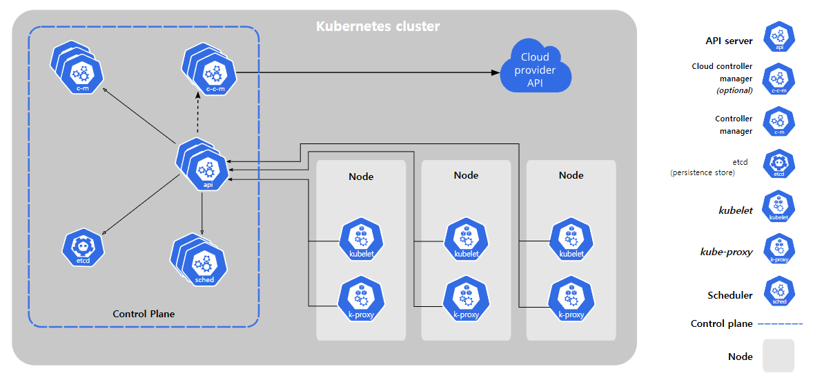

# Container Orchestration

- 컨테이너 오케스트레이션이란 컨테이너를 쉽고 빠르게 배포/확장하고 관리를 자동화해주는 도구이다.
- 여러 개의 서버에 컨테이너를 배포하고 운영하면서 서비스 간 연결을 쉽게 해주는 것이다. (Service Discovery)
- 서버마다 다른 이름을 짓고 개별적으로 관리하는 것이 아니라 서버를 하나로 묶어 적당한 서버를 자동으로 선택해 애플리케이션을 배포하는 것이다.
- 부하가 생기면 컨테이너를 늘리고 일부 서버에 장애가 생기면 정상 작동 중인 서버에 다시 띄워 장애를 방지한다.
- Docker Swarm, Kubernetes, Apache Mesos 등이 있다.

## 기능

- 노드 클러스터링
- 컨테이너 로드 밸런싱
- 컨테이너의 배포와 복제 자동화
- 컨테이너 장애 복구 기능(정상 작동 체크 및 문제 시 재가동)
- 컨테이너 오토스케일링
- 컨테이너 스케줄링
- 로깅 및 모니터링

## Kubernetes

컨테이너화된 애플리케이션의 배포, 확장 및 관리를 자동화하는 오픈소스 플랫폼이다.

단일 서버에서 Docker를 단순히 업로드하고 배포하는 것으로만 사용한다면 Kubernetes를 사용할 이유가 없다. 여러 서버에서 Docker를 사용하게 된다면 어떤 시스템에 컨테이너를 생성하는 것이 맞을까를 생각해야 한다.

### Object

**Basic Object**

- 컨테이너화가 되어 배포되는 애플리케이션의 워크로드를 기술하는 오브젝트
- Pod, Service, Volume, Namespace

**Controller**

- 기본 오브젝트는 애플리케이션을 설정하고 배포하는 것이 가능한데, 이를 좀 더 편리하게 관리하기 위해서 컨트롤러라는 개념을 사용
- Replication Controller, ReplicaSet, Deployment, DaemonSet, Job, StatefuleSet 등

### 배포 방식

애플리케이션을 배포하기 위해 원하는 상태를 다양한 오브젝트에 라벨을 툭여 정의하고 API 서버에 전달하는 방식을 사용한다.

## 구조

### Control Plane - 기능 제어

-	kube-apiserver: 컨트롤 플레인의 Frontend
  - kubectl 명령들이 kube-apiserver로 전송 후 적절한 컴포넌트로 요청 전달
-	etcd: 분산 데이터 저장소
  - 안정적인 동작을 위해 자료를 분산해서 저장하는 구조
  - 클러스터 및 리소스의 구성 정보, 상태 정보 및 명세 정보를 key-value 형태로 저장하는 저장소
-	kube-scheduler: 스케쥴 결정
  - 새로 생성된 파드를 감지하여 어떤 노드로 배치할지 결정하는 작업
-	kube-controller-manager: 관리자
  - 다운된 노드가 없는지, 
  - 파드가 의도한 복제 숫자를 유지하고 있는지, 
  - 서비스와 파드는 적절하게 연결되어 있는지, 
  - 네임스페이스에 대한 기본 계정과 토큰이 생성되어 있는지,
  - 확인하고 적절하지 않다면 적절한 수준을 유지하기 위해 조치하는 역할

### Node - 동작 담당

-	kubelet
  - 노드에서 컨테이너가 동작하도록 관리해주는 핵심 요소
  - 각 노드에서 파드를 생성하고 정상적으로 동작하는지 관리하는 역할
  - kubectl → kube-apiserver → kubelet
-	container runtime
  - 파드에 포함된 컨테이너 실행을 실질적으로 담당하는 애플리케이션
-	kube-proxy
  - 쿠버네티스 클러스터 내부에서 네트워크 요청을 전달하는 역할
  - 쿠버네티스는 파드 IP가 매번 바뀌는데서 오는 어려움을 해결하기 위해 오브젝트를 통해 고정적으로 파드에 접근할 수 있도록 하는 방법을 제공
  - 서비스로 들어온 요청이 파드에 실제로 접근할 수 있는 방법을 관리

