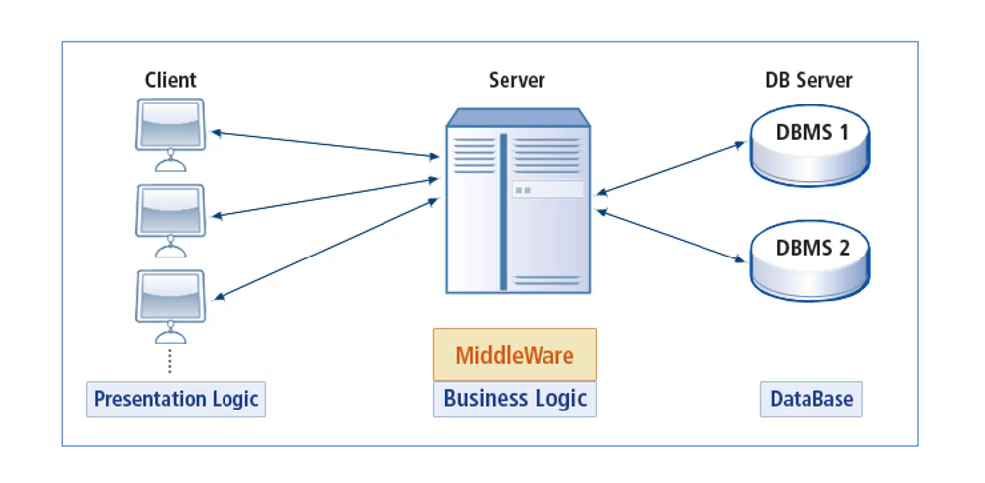
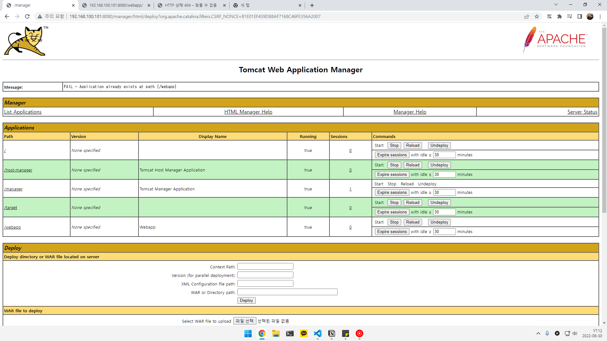
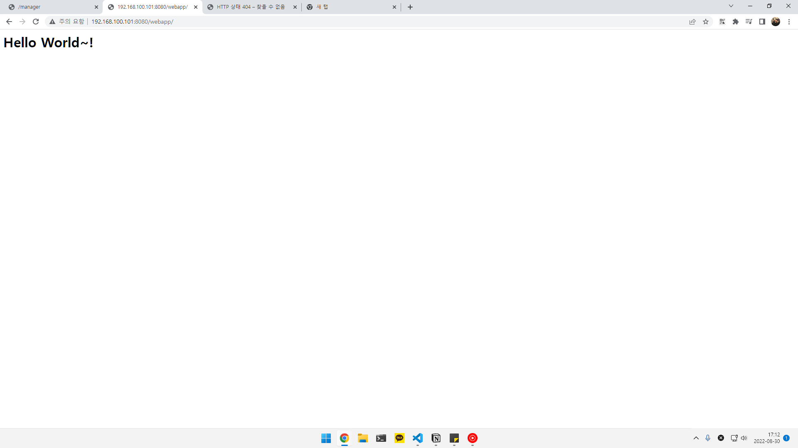
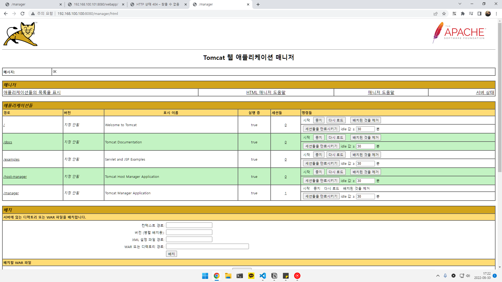
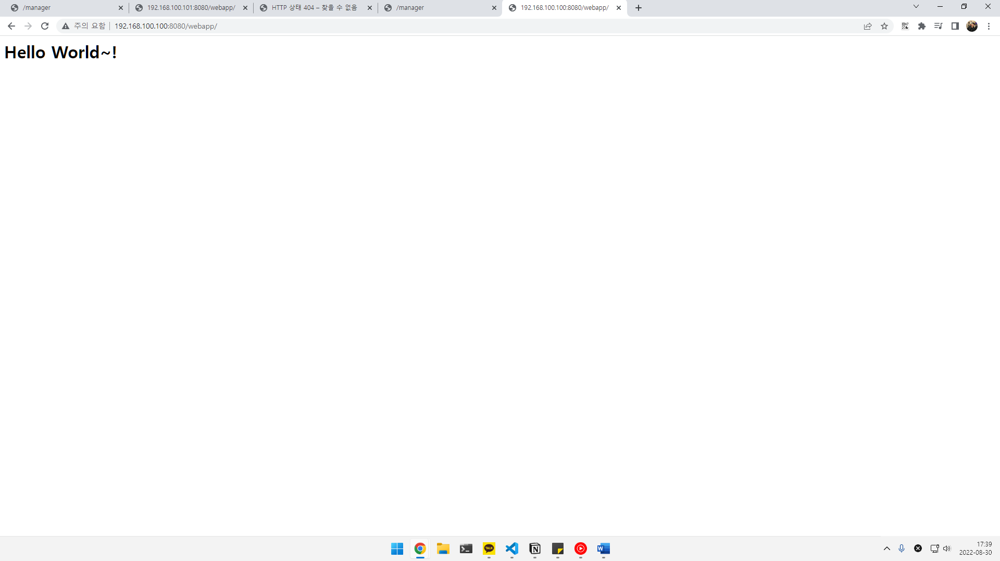

# 미들웨어



DBMS를 직접 클라이언트가 연결되어 동작하는 방식이 여러 가지 단점이 있었음을 알게 된 후 이러한 문제점을 해결하기 위해 등장한 것이 미들웨어이다. 클라이언트와 DBMS 사이에 위의 그림과 같이 또 다른 서버를 두는 방식이다. 클라이언트는 단순히 요청만 중앙에 있는 서버에게 보내고, 중앙에 있는 미들웨어 서버는 대부분의 로직을 수행한다. 이때, 데이터를 조작할 일이 있으면 DBMS에게 부탁한다. 그리고 그 결과를 클라이언트에게 전송하면 클라이언트는 그 결과를 화면에 보여주게 된다. 클라이언트가 해야했던 복잡한 로직은 사라지고, 단순히 화면에 그 결과만 보여주고 사용자로부터 값을 입력 받아서 미들웨어에게만 보내는 역할만 수행하면 되기 때문에 크기가 매우 작아지게 되었다.

미들웨어는 응용 소프트웨어가 운영체제로부터 제공받는 서비스 이외에 추가적으로 이용할 수 있는 서비스를 제공하는 컴퓨터 소프트웨어이다. 응용 소프트웨어는 유연하고 확장, 축소가 편리해야하며 이러한 장점을 충족하기에 개발자의 다른 기종간 플랫폼을 다시 구축할 필요가 없어야 한다. 이를테면 데이버테이스 시스템, 전자통신 소프트웨어, 메시지 및 쿼리 처리 소프트웨어를 들 수 있다.

미들웨어는 양 쪽을 연결하여 데이터를 주고받을 수 있도록 중간에서 매게 역할을 하는 소프트웨어, 네트워크를 통해서 연결된 여러 개의 컴퓨터에 있는 많은 프로세스들에게 어떤 서비스를 사용할 수 있도록 연결해주는 소프트웨어를 말한다. 3계층 클라이언트/서버 구조에서 미들웨어가 존재한다. 웹브라우저에서 데이터베이스로부터 데이터를 저장하거나 읽어올 수 있게 중간에 미들웨어가 존재하게 된다.

대표적으로 TP Monitor, WAS 등이 있다.

클라이언트 사이드의 비즈니스 로직을 최소로 줄이고 비즈니스 로직 자체를 클라이언트와 DBMS 사이의 미들웨어 서버에서 동작하도록 함으로써 클라이언트는 입력과 출력만 담당하게 만들어 클라이언트의 크기를 줄일 수 있다. 만약 프로그램의 비즈니스 로직이 변경되어도 모든 클라이언트를 다시 배포할 필요가 없이 미들웨어만 변경하면 된다.

### 웹 서버

웹 서버는 클라이언트의 요청이 들어오면 정적 페이지를 전용으로 처리하는 역할을 한다. HTTP를 기반으로 하여 클라이언트의 요청을 서비스 하는 기능을 담당한다. 정적 콘텐츠를 제공함에 있어 WAS를 거치지 않고 바로 제공이 가능하며, 동적인 콘텐츠에 대한 요청이 들어오면 WAS에 Request를 보내고 WAS가 처리한 결과를 클라이언트에게 전달한다. 대표적으로 Apache HTTP Server, Nginx 등이 있다.

### WAS

WAS는 DB 조회나 다양한 로직 처리를 요구하는 동적인 컨텐츠를 제공하기 위해 만들어진 Application Server이다. HTTP를 통해 컴퓨터나 장치 어플리케이션을 수행하는 미들웨어이다. 주로 DB 서버와 같이 수행되는데 클라이언트의 요청을 DB 서버와의 매개를 통해 비즈니스 로직 등을 처리하는 역할을 수행한다.

### 웹 서버와 WAS를 분할하여 사용하는 이유

WAS에도 웹 서버처럼 정적인 컨텐츠를 처리하는 데 있어서 성능 상 큰 차이가 없지만 웹 서버와 WAS를 구분하는 이유에는 여러가지가 있다.

일반적으로 웹 페이지는 정적 컨텐츠와 동적 컨텐츠가 모두 존재한다. 그렇기 때문에 DB 조회나 다양한 로직을 처리하기 바쁜 WAS는 정적 컨텐츠에 대한 요청은 웹 서버에 일임하고 동적 컨텐츠를 응답하는 데 집중하여 서버의 부잠을 줄일 수 있다.

두번째로 웹 서버와 WAS를 분리하여 보안강화를 시킬 수 있다. WAS에는 실제 Web Application이 실행되기 때문에 외부와 직접 연결이 되어 있다면 리소스들이 외부로 노출될 우려가 있다.

세번째 이유로는 웹 서버에 여러대의 WAS를 연결하여 로드 밸런싱이 가능하다는 데 있다. 규모가 큰 서비스에서는 하나의 웹 서버에 하나의 WAS가 연결된 구조로는 많은 요청을 처리하는 데에 어려움이 생기게 된다. 그렇기 때문에 WAS를 여러 대 두고 웹 서버에서 요청을 분산시켜 로드밸런싱 해줌으로써 하나의 WAS가 처리하는 요청의 양이 줄어들어 안정적인 서비스 운영이 가능하다. 또한 여러 대의 WAS를 사용하면 하나의 WAS에서 장애가 생기더라도 해당 WAS를 사용 중지시키고 재시작 함으로써 무중단 운영, 장애 극복 등에 유리하다.

# Weblogic, Jeus, Websphere, JBoss, Apache-Tomcat

# Apache-Tomcat

Java 기반의 서블릿 컨테이너이자 웹 서버이다. JSP/Spring으로 웹사이트를 구축한다면 톰캣은 거의 반드시 사용된다고 볼 수 있다.

- 서블릿
    
    동적 웹 페이지를 만들 때 사용되는 자바 기반의 웹 애플리케이션 프로그래밍이다. 
    
    서블릿은 웹 요청과 응답의 흐름을 간단한 메서드 호출만으로 체계적으로 다룰 수 있게 해주는 기술
    

Maven 예제

[https://github.com/ddung1203/source-java-maven-hello-world.git](https://github.com/ddung1203/source-java-maven-hello-world.git)

### Maven

Maven: Java 프로젝트 빌드 도구 빌드:

1. validate: 필요한 정보가 있는지 확인
2. compile: 소스코드 컴파일
3. test: 컴파일된 코드단위 테스트
4. package: JAR/WAR 파일로 생성
5. verify: 통합 테스트
6. install: 로컬 저장소에 배포(~/.m2/repository)
7. deploy: 원격 저장소에 배포

```bash
sudo apt install maven
```

```bash
mvn clean package
```

## 가상머신 내 구축

### Tomcat

```bash
sudo apt search tomcat
```

Tomcat9 패키지와 Tomcat9 관리 패키지 다운로드

```bash
sudo apt install tomcat9 tomcat9-admin
```

다운로드가 완료되면 Apache Tomcat 서버가 설치되고 자동으로 시작된다.

ss 명령어를 사용하여 8080 기본 포트의 listen 확인

```bash
ss -ltn
```

Tomcat 서버에서 Web Application Manager에 대한 사용자를 생성해야 한다.

`/etc/tomcat9/tomcat-users.xml`

```bash
...
  <role rolename="admin-gui"/>
  <role rolename="manager-gui"/>
  <user username="tomcat" password="dkagh1." roles="admin-gui,manager-gui"/>
...
```

Tomcat 재시작 - `sudo systemctl restart tomcat9` 

Tomcat 관리자 페이지

`[http://192.168.100.101:8080/manager/html](http://192.168.100.101:8080/manager/html)` 내 Maven 예제 배포



테스트 확인

```bash
curl 192.168.100.101:8080/webapp/
```

```
<h1> Hello World~! </h1>
```



---

## Jenkins CI/CD at k8s

## 도커 컨테이너 내 구축

도커 이미지 다운

```bash
docker pull tomcat:latest
```

도커 실행

```bash
docker run -it -p 8080:8080 tomcat:latest
```

도커 bash 접속

```bash
docker exec -it [CONTAINER PORT] bash
```

톰캣 사용자 설정

`tomcat-users.xml`

```bash
<role rolename="admin-gui"/>    
<role rolename="manager-gui"/>  
<user username="tomcat" password="dkagh1."  roles="manager-gui,manager-script,manager-status"/>
```

/usr/local/apache-tomcat-8.0.12/conf/catalina/localhost/manager.xml

(해당 파일이 없을 경우 추가)

```bash
<Context privileged="true" antiResourceLocking="false"
    docBase="${catalina.home}/webapps/manager">
	<Valve className="org.apache.catalina.valves.RemoteAddrValve" allow="^.*$" />
</Context>
```

Tomcat 실행

```bash
cd /usr/local/tomcat/bin
./startup.sh
```

Tomcat 관리자 페이지 접속

[`http://192.168.100.100:8080/manager/html`](http://192.168.100.100:8080/manager/html)



Maven hello world 배포 결과

[`http://192.168.100.100:8080/webapp/`](http://192.168.100.100:8080/webapp/)



---

# JBoss

JBoss와 Tomcat은 모두 Java Servlet Application 서버지만 JBoss는 훨씬 더 기능이 많다. 이 둘의 가장 큰 차이점은 JBoss가 EJB(Elastic Java Bean) 및 엔터프러이즈 Java 응용 프로그램에서 작업하는 개발자에게 유용한 기타 기술을 포함하여 완전한 Java Enterprise Edtition 스택을 제공한다는 것이다. 반면, Tomcat은 훨씬 제한적이다. JBoss가 Servlet Container와 Web Server를 포함하는 JEE 스택인 반면 Tomcat은 대부분 Servlet Container와 Web Server이다.

- EJB(Elastic Java Bean)
    
    기업환경의 시스템을 구현하기 위한 서버측 컴포넌트 모델